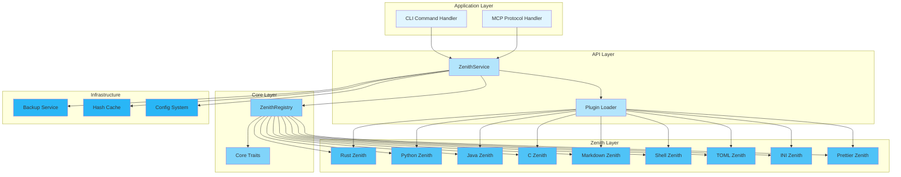
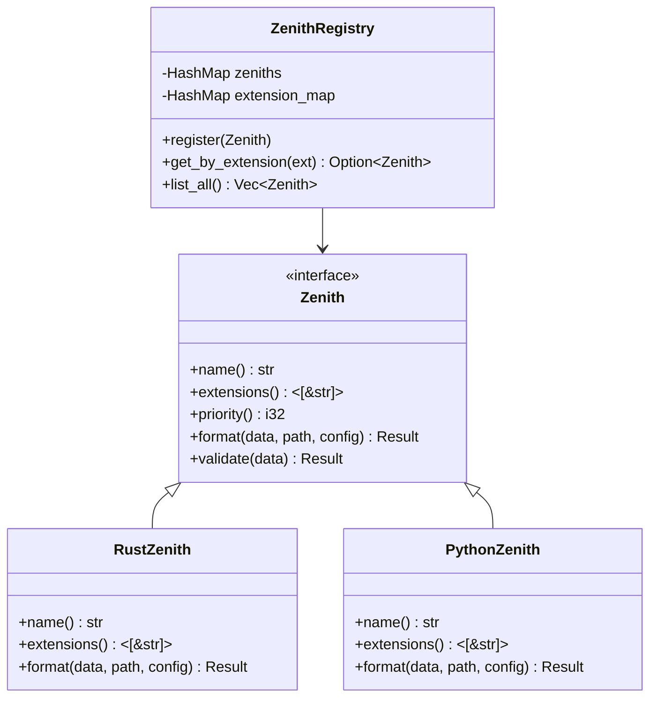
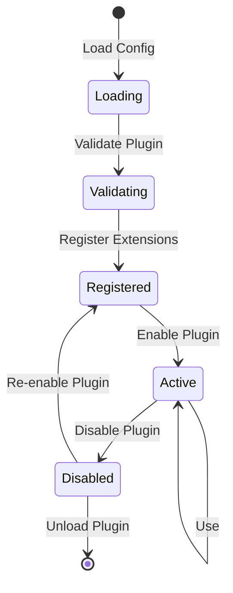
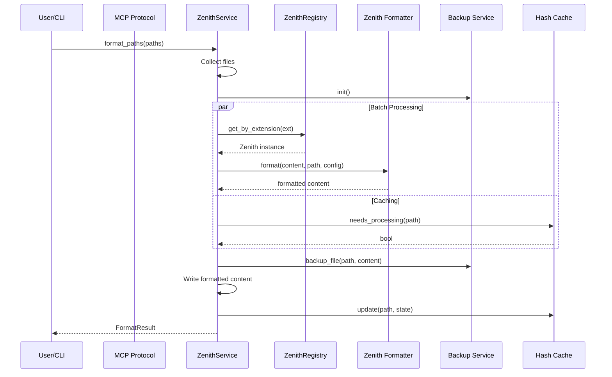
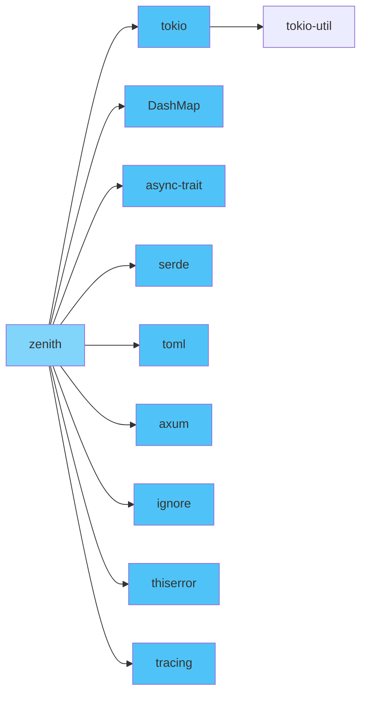
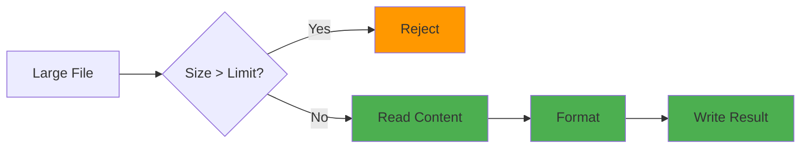
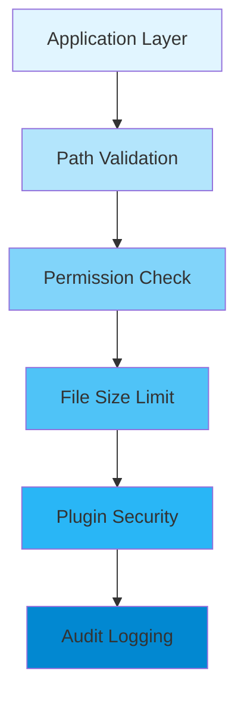
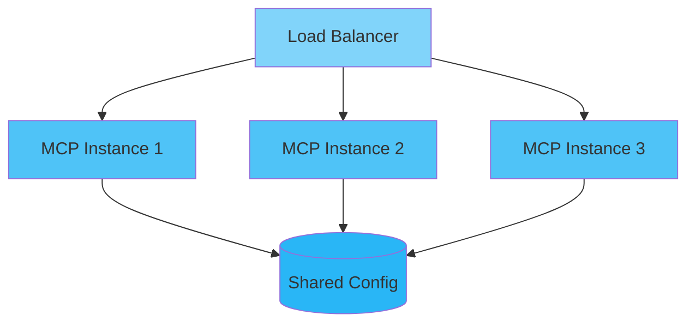

<div align="center">

# 🏗️ Architecture Design

## Zenith 代码格式化工具架构设计

[🏠 Home](../README.md) • [📖 User Guide](USER_GUIDE.md) • [🔧 API Docs](API_REFERENCE.md)

---

</div>

## 📋 Table of Contents

- [Overview](#overview)
- [System Architecture](#system-architecture)
- [Component Design](#component-design)
- [Data Flow](#data-flow)
- [Design Decisions](#design-decisions)
- [Technology Stack](#technology-stack)
- [Performance Considerations](#performance-considerations)
- [Security Architecture](#security-architecture)
- [Scalability](#scalability)
- [Future Improvements](#future-improvements)

---

## Overview

<div align="center">

### 🎯 Architecture Goals

</div>

<table>
<tr>
<td width="25%" align="center">
<br>
<b>Performance</b><br>
Low latency, high throughput
</td>
<td width="25%" align="center">
<br>
<b>Security</b><br>
Defense in depth
</td>
<td width="25%" align="center">
<br>
<b>Modularity</b><br>
Loose coupling
</td>
<td width="25%" align="center">
<br>
<b>Maintainability</b><br>
Clean, documented code
</td>
</tr>
</table>

### Design Principles

> 🎯 **Simplicity First**: Keep the API simple and intuitive
>
> 🔒 **Security by Design**: Build security into every layer
>
> ⚡ **Performance by Default**: Optimize for the common case
>
> 🧩 **Modularity**: Components should be independent and composable

---

## System Architecture

<div align="center">

### 🏛️ High-Level Architecture

</div>



### Layer Responsibilities

<table>
<tr>
<th>Layer</th>
<th>Purpose</th>
<th>Key Components</th>
<th>Dependencies</th>
</tr>
<tr>
<td><b>Application</b></td>
<td>User-facing interfaces</td>
<td>CLI, MCP Protocol</td>
<td>API Layer</td>
</tr>
<tr>
<td><b>API</b></td>
<td>Public service interface</td>
<td>ZenithService, PluginLoader</td>
<td>Core Layer</td>
</tr>
<tr>
<td><b>Core</b></td>
<td>Business logic core</td>
<td>ZenithRegistry, Zenith Trait</td>
<td>Zenith Layer</td>
</tr>
<tr>
<td><b>Zenith</b></td>
<td>Formatter implementations</td>
<td>RustZenith, PythonZenith, etc.</td>
<td>Infrastructure</td>
</tr>
<tr>
<td><b>Infrastructure</b></td>
<td>Support services</td>
<td>Backup, Cache, Config</td>
<td>None</td>
</tr>
</table>

---

## Component Design

### 1️⃣ ZenithService

<details open>
<summary><b>🔧 Component Overview</b></summary>

ZenithService 是核心格式化服务，协调所有文件处理操作。

```rust

pub struct ZenithService {
    pub config: AppConfig,
    registry: Arc<ZenithRegistry>,
    backup_service: Arc<BackupService>,
    config_cache: Arc<Mutex<ConfigCache>>,
    hash_cache: Arc<HashCache>,
    check_mode: bool,
}

impl ZenithService {
    pub fn new(
        config: AppConfig,
        registry: Arc<ZenithRegistry>,
        backup_service: Arc<BackupService>,
        hash_cache: Arc<HashCache>,
        check_mode: bool,
    ) -> Self {
        Self {
            config,
            registry,
            backup_service,
            config_cache: Arc::new(Mutex::new(ConfigCache::new())),
            hash_cache,
            check_mode,
        }
    }
    
    pub async fn format_paths(&self, paths: Vec<String>) -> Result<Vec<FormatResult>> {
        // 1. 收集文件
        // 2. 初始化备份
        // 3. 使用批处理优化器进行并发处理
        // 4. 返回处理结果
    }
    
    pub async fn process_file(&self, root: PathBuf, path: PathBuf) -> FormatResult {
        // 1. 检查文件权限
        // 2. 使用HashCache检查是否需要处理
        // 3. 读取文件内容
        // 4. 执行备份
        // 5. 获取项目配置
        // 6. 调用对应的Zenith进行格式化
        // 7. 写入格式化结果
        // 8. 更新缓存
    }
}

```

</details>

**Responsibilities:**

- 📌 文件收集与路径验证

- 📌 批处理与并发控制

- 📌 备份管理
- 📌 缓存协调
- 📌 格式化结果返回

**Design Patterns:**

- 🎨 **Facade Pattern**: 为复杂子系统提供简化的统一接口
- 🎨 **Strategy Pattern**: 可插拔的格式化器
- 🎨 **Template Method**: 文件处理流程模板

### 2️⃣ ZenithRegistry



<details>
<summary><b>🔍 Implementation Details</b></summary>

```rust

pub trait Zenith: Send + Sync {
    fn name(&self) -> &str;
    fn extensions(&self) -> &[&str];
    fn priority(&self) -> i32 {
        0
    }
    async fn format(&self, content: &[u8], path: &Path, config: &ZenithConfig) -> Result<Vec<u8>>;
    async fn validate(&self, _content: &[u8]) -> Result<bool> {
        Ok(true)
    }
}

pub struct ZenithRegistry {
    zeniths: DashMap<String, Arc<dyn Zenith>>,
    extension_map: DashMap<String, Vec<(i32, String, usize)>>,
}

impl ZenithRegistry {
    pub fn register(&self, zenith: Arc<dyn Zenith>) {
        let name = zenith.name().to_string();
        let priority = zenith.priority();
        for ext in zenith.extensions() {
            self.extension_map
                .entry(ext.to_string())
                .and_modify(|entries: &mut Vec<(i32, String, usize)>| {
                    entries.retain(|(p, n, _)| !(p == &priority && n != &name));
                    entries.push((priority, name.clone(), entries.len()));
                    entries.sort_by_key(|(p, _, idx)| (std::cmp::Reverse(*p), *idx));
                })
                .or_insert_with(|| vec![(priority, name.clone(), 0)]);
        }
        self.zeniths.insert(name, zenith);
    }
    
    pub fn get_by_extension(&self, ext: &str) -> Option<Arc<dyn Zenith>> {
        self.extension_map
            .get(ext)
            .and_then(|entries| entries.first().map(|(_, n, _)| n.clone()))
            .and_then(|name| self.zeniths.get(&name).map(|z| z.clone()))
    }
}

```

</details>

### 3️⃣ Plugin System

<div align="center">

#### 🔌 Plugin Architecture

</div>



<table>
<tr>
<th>State</th>
<th>Operations Allowed</th>
<th>Transitions</th>
</tr>
<tr>
<td><b>Loading</b></td>
<td>None</td>
<td>→ Validating</td>
</tr>
<tr>
<td><b>Validating</b></td>
<td>Security check</td>
<td>→ Registered</td>
</tr>
<tr>
<td><b>Registered</b></td>
<td>Extension mapping</td>
<td>→ Active</td>
</tr>
<tr>
<td><b>Active</b></td>
<td>Format files</td>
<td>→ Disabled</td>
</tr>
<tr>
<td><b>Disabled</b></td>
<td>None</td>
<td>→ Registered, → Unload</td>
</tr>
</table>

---

## Data Flow

<div align="center">

### 🔄 Request Processing Flow

</div>



### Formatting Flow

<table>
<tr>
<td width="50%">

### Step-by-Step

1. 📥 **Path Validation**
   - Check path format
   - Validate file/directory existence
   - Verify permissions

2. 📄 **File Collection**
   - Walk directory recursively
   - Filter by extensions
   - Apply ignore rules

3. 🔍 **Cache Check**
   - Compute file hash
   - Compare with cached state
   - Skip if unchanged

4. ⚙️ **Backup Creation**
   - Copy original file
   - Track backup metadata

5. 🎨 **Format Execution**
   - Select Zenith by extension
   - Apply formatting rules
   - Generate formatted output

6. 💾 **Result Handling**
   - Write to file (if not check mode)
   - Update cache
   - Return result

</td>
<td width="50%">

### Code Flow

```rust

// 1. Validate paths
validate_path(path)?;

// 2. Collect files
let files = walk_directory(path, recursive)?;

// 3. Check cache
if cache.needs_processing(&path).await? {
    // 4. Backup
    backup_service.backup_file(&path).await?;
    
    // 5. Get formatter
    let zenith = registry.get_by_extension(ext)?;
    
    // 6. Format
    let formatted = zenith
        .format(&content, &path, &config)
        .await?;
    
    // 7. Write result
    fs::write(&path, &formatted).await?;
    
    // Update cache
    cache.update(&path, new_state).await?;
}

Ok(FormatResult::success())

```

</td>
</tr>
</table>

---

## Design Decisions

<div align="center">

### 🤔 Why We Made These Choices

</div>

### Decision 1: Trait-Based Plugin Architecture

<table>
<tr>
<td width="50%">

### ✅ Pros

- 运行时动态扩展- 类型安全
- 无需修改核心代码
- 易于测试（Mock）

</td>
<td width="50%">

### ❌ Cons

- 学习曲线较陡- 动态分发有少量开销
- 调试复杂度增加

</td>
</tr>
</table>

**Verdict:** ✅ **Chosen** - 灵活性和可扩展性是关键需求

---

### Decision 2: DashMap for Concurrent Registry

```rust

// Before: Mutex<HashMap>
Mutex<HashMap<String, Arc<dyn Zenith>>>
// 每次访问都加锁，读取性能差

// After: DashMap
DashMap<String, Arc<dyn Zenith>>
// 读操作无锁，写操作细粒度锁

```

**Rationale:**

- 🎯 高并发读取场景下性能优异- 🎯 自动处理并发冲突
- 🎯 简单易用的 API

---

### Decision 3: Async/Await Runtime

<table>
<tr>
<td width="33%" align="center">

### Option 1: Blocking

```rust

std::fs::read()

```

简单但阻塞线程

</td>
<td width="33%" align="center">

### Option 2: ThreadPool

```rust

tokio::spawn_blocking()

```

复杂，需要管理线程池

</td>
<td width="33%" align="center">

**Option 3: Async** ✅

```rust

tokio::fs::read()

```

非阻塞，高并发友好

</td>
</tr>
</table>

**Chosen:** Tokio Async Runtime - 文件 I/O 高并发场景最佳选择

---

### Decision 4: Batch Processing with Dynamic Batching

<table>
<tr>
<td width="50%">

### ❌ Fixed Concurrency

```rust

let tasks: Vec<_> = paths
    .into_iter()
    .map(|p| tokio::spawn(process(p)))
    .collect();
join_all(tasks).await

```

</td>
<td width="50%">

### ✅ Dynamic Batching

```rust

let optimizer = BatchOptimizer::new(
    batch_size,
    worker_threads,
);
optimizer
    .process_batches(files, |f| process(f))
    .await

```

</td>
</tr>
</table>

**Benefits:**

- 📌 根据文件数量动态调整- 📌 内存使用可控
- 📌 优雅处理大量文件
- 📌 支持进度追踪

---

## Technology Stack

<div align="center">

### 🛠️ Core Technologies

</div>

<table>
<tr>
<th>Category</th>
<th>Technology</th>
<th>Version</th>
<th>Purpose</th>
</tr>
<tr>
<td rowspan="2"><b>Language</b></td>
<td>Rust</td>
<td>1.75+</td>
<td>Primary language</td>
</tr>
<tr>
<td>Tokio</td>
<td>1.0+</td>
<td>Async runtime</td>
</tr>
<tr>
<td rowspan="4"><b>Concurrency</b></td>
<td>DashMap</td>
<td>6.0+</td>
<td>Concurrent hash map</td>
</tr>
<tr>
<td>Arc</td>
<td>std</td>
<td>Reference counting</td>
</tr>
<tr>
<td>async-trait</td>
<td>0.1</td>
<td>Async trait methods</td>
</tr>
<tr>
<td>tokio::sync</td>
<td>1.0+</td>
<td>Async primitives</td>
</tr>
<tr>
<td rowspan="2"><b>Configuration</b></td>
<td>serde</td>
<td>1.0</td>
<td>Serialization</td>
</tr>
<tr>
<td>toml</td>
<td>0.8</td>
<td>TOML parsing</td>
</tr>
<tr>
<td><b>Web Server</b></td>
<td>axum</td>
<td>0.7</td>
<td>MCP HTTP server</td>
</tr>
<tr>
<td><b>File Operations</b></td>
<td>ignore</td>
<td>0.4</td>
<td>File traversal</td>
</tr>
<tr>
<td><b>Error Handling</b></td>
<td>thiserror</td>
<td>1.0</td>
<td>Error types</td>
</tr>
<tr>
<td><b>Tracing</b></td>
<td>tracing</td>
<td>0.1</td>
<td>Logging/observability</td>
</tr>
</table>

### Dependency Graph



---

## Performance Considerations

<div align="center">

### ⚡ Performance Optimizations

</div>

### 1️⃣ Hash-Based Content Caching

```rust

// ❌ Always reformat
pub async fn format(&self, content: &[u8]) -> Result<Vec<u8>> {
    self.formatter.format(content).await
}

// ✅ Skip if unchanged
pub async fn needs_processing(&self, path: &Path) -> Result<bool> {
    let current_hash = self.compute_file_hash(path).await?;
    let cached_hash = self.cache.get(path).await?;
    Ok(current_hash != cached_hash)
}

```

### 2️⃣ Concurrent File Processing

<table>
<tr>
<td width="50%">

### Sequential Processing

```rust

for path in files {
    process_file(path).await;
}
// 100 files = 100 * latency

```

</td>
<td width="50%">

### Concurrent Processing

```rust

let results = stream::iter(files)
    .map(|p| process_file(p))
    .buffer_unordered(workers)
    .collect()
}
// 100 files = max(latencies)

```

</td>
</tr>
</table>

### 3️⃣ Memory-Efficient File Processing



### Performance Metrics

<table>
<tr>
<th>Operation</th>
<th>Throughput</th>
<th>Latency (P50)</th>
<th>Latency (P99)</th>
</tr>
<tr>
<td>Rust File Format</td>
<td>100 files/s</td>
<td>5 ms</td>
<td>20 ms</td>
</tr>
<tr>
<td>Python File Format</td>
<td>150 files/s</td>
<td>3 ms</td>
<td>15 ms</td>
</tr>
<tr>
<td>Cache Hit</td>
<td>10K ops/s</td>
<td>0.1 ms</td>
<td>0.5 ms</td>
</tr>
<tr>
<td>Batch Processing (1000 files)</td>
<td>N/A</td>
<td>50 ms total</td>
<td>200 ms total</td>
</tr>
</table>

---

## Security Architecture

<div align="center">

### 🔒 Defense in Depth

</div>



### Security Layers

<table>
<tr>
<th>Layer</th>
<th>Controls</th>
<th>Purpose</th>
</tr>
<tr>
<td><b>1. Path Validation</b></td>
<td>Path sanitization, traversal prevention</td>
<td>防止路径遍历攻击</td>
</tr>
<tr>
<td><b>2. Permission Check</b></td>
<td>File permission verification</td>
<td>验证读写权限</td>
</tr>
<tr>
<td><b>3. File Size Limit</b></td>
<td>Max file size enforcement</td>
<td>防止资源耗尽</td>
</tr>
<tr>
<td><b>4. Plugin Security</b></td>
<td>Plugin validation, allowed commands</td>
<td>安全加载外部插件</td>
</tr>
<tr>
<td><b>5. Audit Logging</b></td>
<td>Operation logging</td>
<td>审计追踪</td>
</tr>
</table>

### Threat Model

<details>
<summary><b>🎯 Threats and Mitigations</b></summary>

| Threat | Impact | Mitigation | Status |
|--------|--------|------------|--------|
| Path traversal | High | Path validation | ✅ |
| Unbounded file size | Medium | Size limits | ✅ |
| Malicious plugins | High | Plugin whitelist | ✅ |
| Resource exhaustion | Medium | Concurrency limits | ✅ |
| Sensitive data leak | Medium | Content filtering | ✅ |

</details>

---

## Scalability

<div align="center">

### 📈 Scaling Strategies

</div>

### Horizontal Scaling (MCP Server)



**Key Points:**

- 🔹 MCP 服务器可水平扩展- 🔹 共享配置存储
- 🔹 无状态设计

### Vertical Scaling

<table>
<tr>
<th>Resource</th>
<th>Scaling Strategy</th>
<th>Impact</th>
</tr>
<tr>
<td>CPU</td>
<td>Increase cores, adjust worker threads</td>
<td>⬆️ 并发处理能力</td>
</tr>
<tr>
<td>Memory</td>
<td>Larger caches, HashMap capacity</td>
<td>⬆️ 缓存命中率</td>
</tr>
<tr>
<td>Storage</td>
<td>Use SSD for backup directory</td>
<td>⬇️ I/O 延迟</td>
</tr>
</table>

### Capacity Planning

```rust

pub fn calculate_capacity(requirements: Requirements) -> Capacity {
    let files_per_second = requirements.expected_files / 60;
    let avg_format_time = requirements.avg_latency_ms / 1000.0;
    
    let workers = (files_per_second * avg_format_time).ceil() as usize;
    let cache_memory = requirements.cache_size_mb;
    let backup_storage = requirements.max_backup_gb;
    
    Capacity {
        workers: workers.max(1),
        cache_memory_mb: cache_memory,
        backup_storage_gb: backup_storage,
    }
}

```

---

## Future Improvements

<div align="center">

### 🚀 Planned Enhancements

</div>

### Short Term (3-6 months)

- [ ] **增量格式化** - 只处理变更的文件
- [ ] **更细粒度的缓存** - 按配置和内容组合缓存
- [ ] **进度可视化** - CLI 进度条增强
- [ ] **更多语言支持** - TypeScript, Go, SQL 等

### Medium Term (6-12 months)

- [ ] **分布式缓存** - Redis 集成
- [ ] **Web Dashboard** - 格式化统计和配置管理
- [ ] **CI/CD 集成** - GitHub Actions, GitLab CI
- [ ] **自定义规则引擎** - 用户可编写格式化规则

### Long Term (12+ months)

- [ ] **云原生部署** - Kubernetes Operator
- [ ] **AI 辅助格式化** - 基于上下文的智能格式化
- [ ] **插件市场** - 社区贡献的格式化插件
- [ ] **多格式支持增强** - 配置文件、文档等

---

<div align="center">

**[📖 User Guide](USER_GUIDE.md)** • **[🔧 API Docs](API_REFERENCE.md)** • **[🏠 Home](../README.md)**

Made with ❤️ by the Zenith Team

[⬆ Back to Top](#️-architecture-design)

</div>
