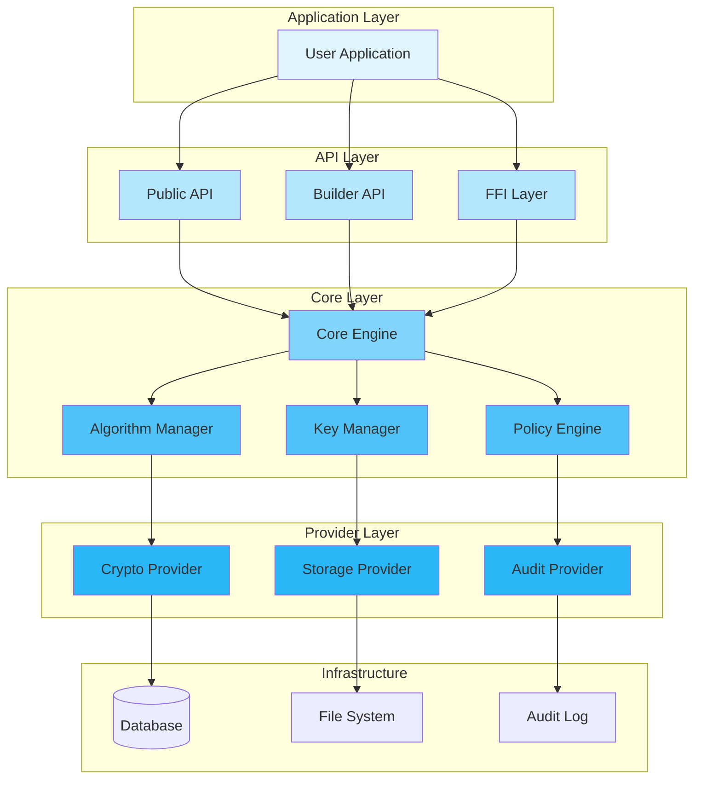
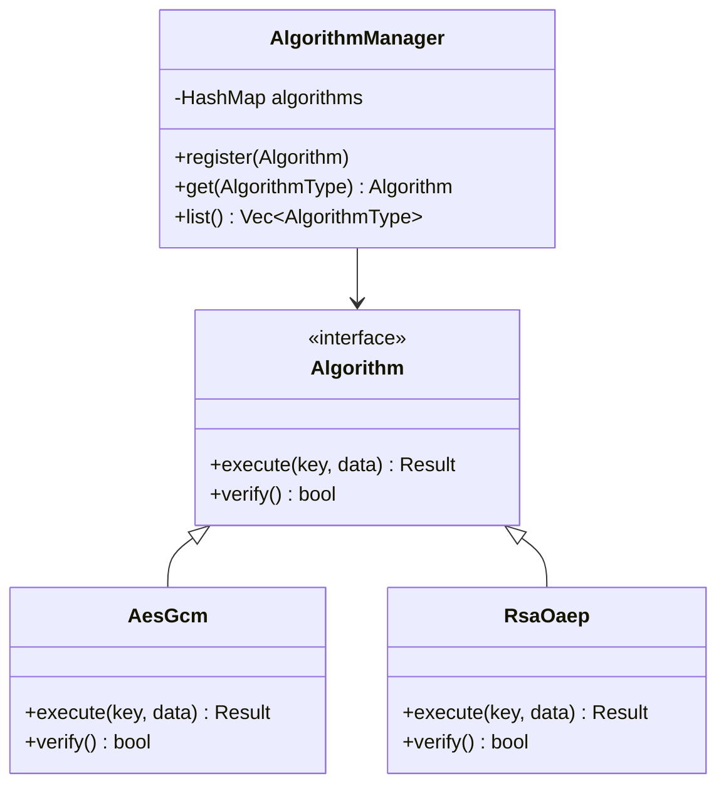
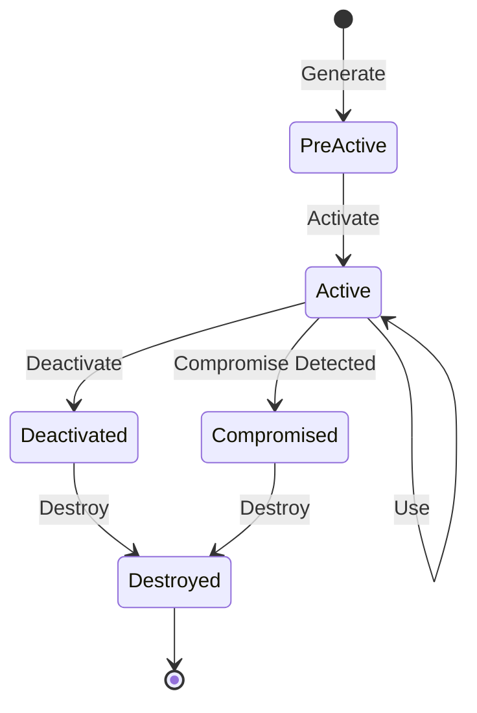
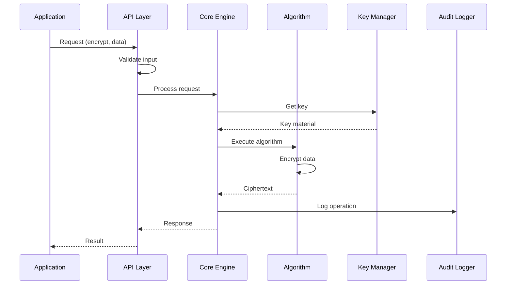
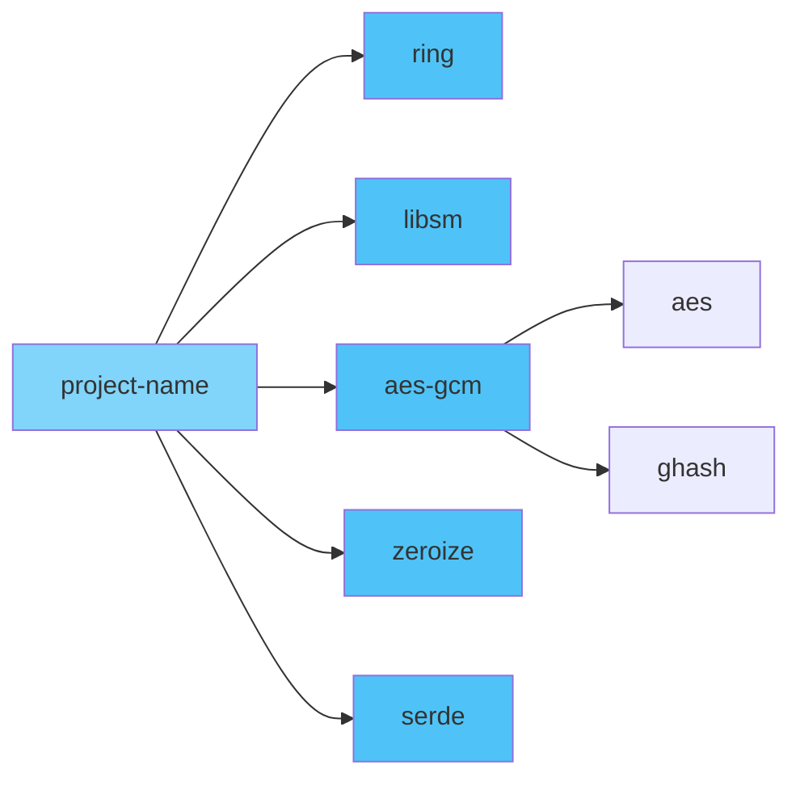
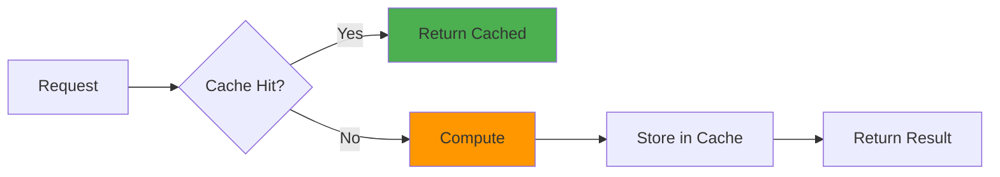
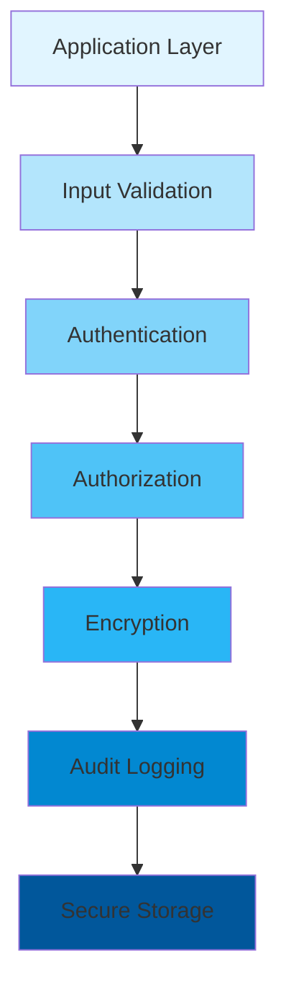
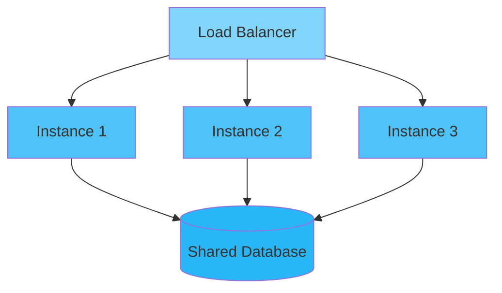

<div align="center">

# 🏗️ Architecture Design

### Technical Architecture & Design Decisions

[🏠 Home](../README.md) • [📖 User Guide](USER_GUIDE.md) • [🔧 API Docs](https://docs.rs/project-name)

---

</div>

## 📋 Table of Contents

- [Overview](#overview)
- [System Architecture](#system-architecture)
- [Component Design](#component-design)
- [Data Flow](#data-flow)
- [Design Decisions](#design-decisions)
- [Technology Stack](#technology-stack)
- [Performance Considerations](#performance-considerations)
- [Security Architecture](#security-architecture)
- [Scalability](#scalability)
- [Future Improvements](#future-improvements)

---

## Overview

<div align="center">

### 🎯 Architecture Goals

</div>

<table>
<tr>
<td width="25%" align="center">
<br>
<b>Performance</b><br>
Low latency, high throughput
</td>
<td width="25%" align="center">
<br>
<b>Security</b><br>
Defense in depth
</td>
<td width="25%" align="center">
<br>
<b>Modularity</b><br>
Loose coupling
</td>
<td width="25%" align="center">
<br>
<b>Maintainability</b><br>
Clean, documented code
</td>
</tr>
</table>

### Design Principles

> 🎯 **Simplicity First**: Keep the API simple and intuitive
> 
> 🔒 **Security by Design**: Build security into every layer
> 
> ⚡ **Performance by Default**: Optimize for the common case
> 
> 🧩 **Modularity**: Components should be independent and composable

---

## System Architecture

<div align="center">

### 🏛️ High-Level Architecture

</div>



### Layer Responsibilities

<table>
<tr>
<th>Layer</th>
<th>Purpose</th>
<th>Key Components</th>
<th>Dependencies</th>
</tr>
<tr>
<td><b>Application</b></td>
<td>User-facing code</td>
<td>Business logic, workflows</td>
<td>API Layer</td>
</tr>
<tr>
<td><b>API</b></td>
<td>Public interface</td>
<td>API handlers, validators</td>
<td>Core Layer</td>
</tr>
<tr>
<td><b>Core</b></td>
<td>Business logic</td>
<td>Engine, managers, policies</td>
<td>Provider Layer</td>
</tr>
<tr>
<td><b>Provider</b></td>
<td>Implementation adapters</td>
<td>Crypto, storage, audit</td>
<td>Infrastructure</td>
</tr>
<tr>
<td><b>Infrastructure</b></td>
<td>Low-level resources</td>
<td>DB, filesystem, logs</td>
<td>None</td>
</tr>
</table>

---

## Component Design

### 1️⃣ Core Engine

<details open>
<summary><b>🔧 Component Overview</b></summary>

The Core Engine is the heart of the system, coordinating all operations.

```rust
pub struct CoreEngine {
    algorithm_manager: Arc<AlgorithmManager>,
    key_manager: Arc<KeyManager>,
    policy_engine: Arc<PolicyEngine>,
    config: Config,
}

impl CoreEngine {
    pub fn new(config: Config) -> Result<Self> {
        // Initialize managers
        let algorithm_manager = Arc::new(AlgorithmManager::new()?);
        let key_manager = Arc::new(KeyManager::new()?);
        let policy_engine = Arc::new(PolicyEngine::new()?);
        
        Ok(Self {
            algorithm_manager,
            key_manager,
            policy_engine,
            config,
        })
    }
    
    pub fn process(&self, request: Request) -> Result<Response> {
        // 1. Validate request
        self.policy_engine.validate(&request)?;
        
        // 2. Get algorithm
        let algorithm = self.algorithm_manager.get(request.algorithm())?;
        
        // 3. Get key
        let key = self.key_manager.get(request.key_id())?;
        
        // 4. Execute operation
        let result = algorithm.execute(&key, request.data())?;
        
        Ok(Response::new(result))
    }
}
```

</details>

**Responsibilities:**
- 📌 Request orchestration
- 📌 Component coordination
- 📌 Error handling
- 📌 Resource management

**Design Patterns:**
- 🎨 **Facade Pattern**: Simplified interface to complex subsystems
- 🎨 **Strategy Pattern**: Pluggable algorithms
- 🎨 **Builder Pattern**: Flexible configuration

### 2️⃣ Algorithm Manager



<details>
<summary><b>🔍 Implementation Details</b></summary>

```rust
pub trait Algorithm: Send + Sync {
    fn execute(&self, key: &Key, data: &[u8]) -> Result<Vec<u8>>;
    fn verify(&self) -> bool;
    fn metadata(&self) -> AlgorithmMetadata;
}

pub struct AlgorithmManager {
    algorithms: RwLock<HashMap<AlgorithmType, Box<dyn Algorithm>>>,
}

impl AlgorithmManager {
    pub fn register<A: Algorithm + 'static>(&self, algo: A) -> Result<()> {
        let metadata = algo.metadata();
        let mut algorithms = self.algorithms.write().unwrap();
        algorithms.insert(metadata.algorithm_type, Box::new(algo));
        Ok(())
    }
    
    pub fn get(&self, algo_type: AlgorithmType) -> Result<&dyn Algorithm> {
        self.algorithms
            .read()
            .unwrap()
            .get(&algo_type)
            .ok_or(Error::AlgorithmNotFound)
    }
}
```

</details>

### 3️⃣ Key Manager

<div align="center">

#### 🔐 Key Lifecycle Management

</div>



<table>
<tr>
<th>State</th>
<th>Operations Allowed</th>
<th>Transitions</th>
</tr>
<tr>
<td><b>PreActive</b></td>
<td>None</td>
<td>→ Active</td>
</tr>
<tr>
<td><b>Active</b></td>
<td>Encrypt, Decrypt, Sign, Verify</td>
<td>→ Deactivated, → Compromised</td>
</tr>
<tr>
<td><b>Deactivated</b></td>
<td>Decrypt, Verify (read-only)</td>
<td>→ Destroyed</td>
</tr>
<tr>
<td><b>Compromised</b></td>
<td>None</td>
<td>→ Destroyed</td>
</tr>
<tr>
<td><b>Destroyed</b></td>
<td>None</td>
<td>(Terminal state)</td>
</tr>
</table>

---

## Data Flow

<div align="center">

### 🔄 Request Processing Flow

</div>



### Encryption Flow

<table>
<tr>
<td width="50%">

**Step-by-Step**

1. 📥 **Input Validation**
   - Check data format
   - Validate algorithm type
   - Verify key ID exists

2. 🔐 **Key Retrieval**
   - Load key from storage
   - Verify key state (Active)
   - Check permissions

3. ⚙️ **Algorithm Execution**
   - Initialize algorithm
   - Generate nonce/IV
   - Encrypt data

4. 📤 **Output Construction**
   - Package ciphertext
   - Add metadata
   - Return result

5. 📝 **Audit Logging**
   - Record operation
   - Log timestamp
   - Store metadata

</td>
<td width="50%">

**Code Flow**

```rust
// 1. Validate
request.validate()?;

// 2. Get key
let key = key_manager
    .get(request.key_id)?;

// 3. Execute
let ciphertext = algorithm
    .encrypt(&key, request.data)?;

// 4. Package
let response = Response {
    data: ciphertext,
    metadata: Metadata {
        algorithm: algo_type,
        key_id: key.id(),
        timestamp: now(),
    },
};

// 5. Audit
audit_logger.log(&response)?;

Ok(response)
```

</td>
</tr>
</table>

---

## Design Decisions

<div align="center">

### 🤔 Why We Made These Choices

</div>

### Decision 1: Pure Rust Implementation

<table>
<tr>
<td width="50%">

**✅ Pros**
- Memory safety guarantees
- Zero-cost abstractions
- Excellent performance
- No C dependencies
- Modern tooling

</td>
<td width="50%">

**❌ Cons**
- Steeper learning curve
- Fewer libraries initially
- Compilation time

</td>
</tr>
</table>

**Verdict:** ✅ **Chosen** - Safety and performance benefits outweigh cons

---

### Decision 2: Pluggable Algorithm Architecture

```rust
// Before: Hardcoded algorithms
match algo_type {
    AlgorithmType::AES => aes_encrypt(data),
    AlgorithmType::RSA => rsa_encrypt(data),
    // Must modify code for new algorithms
}

// After: Plugin system
let algorithm = algorithm_manager.get(algo_type)?;
algorithm.execute(key, data)?;
// New algorithms can be added without code changes
```

**Rationale:**
- 🎯 Extensibility: Easy to add new algorithms
- 🎯 Testability: Mock algorithms for testing
- 🎯 Maintainability: Algorithms are independent

---

### Decision 3: Arc + RwLock for Concurrency

<table>
<tr>
<td width="33%" align="center">

**Option 1: Mutex**
```rust
Arc<Mutex<Data>>
```
Simple but locks readers

</td>
<td width="33%" align="center">

**Option 2: RwLock** ✅
```rust
Arc<RwLock<Data>>
```
Multiple readers, one writer

</td>
<td width="33%" align="center">

**Option 3: Channels**
```rust
mpsc::channel()
```
Complex for simple cases

</td>
</tr>
</table>

**Chosen:** RwLock - Optimized for read-heavy workloads

---

### Decision 4: Builder Pattern for Configuration

<table>
<tr>
<td width="50%">

**❌ Direct Construction**
```rust
let config = Config {
    option_a: value_a,
    option_b: value_b,
    option_c: value_c,
    // Many fields...
};
```

</td>
<td width="50%">

**✅ Builder Pattern**
```rust
let config = Config::builder()
    .option_a(value_a)
    .option_b(value_b)
    .build()?;
```

</td>
</tr>
</table>

**Benefits:**
- 📌 Fluent API
- 📌 Optional parameters
- 📌 Validation on build
- 📌 Better error messages

---

## Technology Stack

<div align="center">

### 🛠️ Core Technologies

</div>

<table>
<tr>
<th>Category</th>
<th>Technology</th>
<th>Version</th>
<th>Purpose</th>
</tr>
<tr>
<td rowspan="2"><b>Language</b></td>
<td>Rust</td>
<td>1.75+</td>
<td>Primary language</td>
</tr>
<tr>
<td>C (FFI)</td>
<td>C11</td>
<td>Foreign function interface</td>
</tr>
<tr>
<td rowspan="3"><b>Cryptography</b></td>
<td>ring</td>
<td>0.17</td>
<td>Modern crypto primitives</td>
</tr>
<tr>
<td>libsm</td>
<td>0.6</td>
<td>Chinese national standards</td>
</tr>
<tr>
<td>aes-gcm</td>
<td>0.10</td>
<td>AES-GCM implementation</td>
</tr>
<tr>
<td rowspan="2"><b>Security</b></td>
<td>zeroize</td>
<td>1.7</td>
<td>Secure memory cleanup</td>
</tr>
<tr>
<td>argon2</td>
<td>0.5</td>
<td>Password hashing</td>
</tr>
<tr>
<td><b>Serialization</b></td>
<td>serde</td>
<td>1.0</td>
<td>Data serialization</td>
</tr>
<tr>
<td><b>Error Handling</b></td>
<td>thiserror</td>
<td>1.0</td>
<td>Error types</td>
</tr>
<tr>
<td><b>Testing</b></td>
<td>criterion</td>
<td>0.5</td>
<td>Benchmarking</td>
</tr>
</table>

### Dependency Graph



---

## Performance Considerations

<div align="center">

### ⚡ Performance Optimizations

</div>

### 1️⃣ Zero-Copy Design

```rust
// ❌ Copying data
pub fn process(data: Vec<u8>) -> Vec<u8> {
    let copied = data.clone();  // Unnecessary copy
    transform(copied)
}

// ✅ Zero-copy with slices
pub fn process(data: &[u8]) -> Vec<u8> {
    transform(data)  // No copy needed
}
```

### 2️⃣ Memory Pooling

<table>
<tr>
<td width="50%">

**Without Pooling**
```rust
// Allocate for every operation
let buffer = vec![0u8; size];
process(&buffer);
// Buffer dropped
```

</td>
<td width="50%">

**With Pooling**
```rust
// Reuse buffers
let buffer = pool.acquire();
process(&buffer);
pool.release(buffer);
```

</td>
</tr>
</table>

### 3️⃣ Caching Strategy



### Performance Metrics

<table>
<tr>
<th>Operation</th>
<th>Throughput</th>
<th>Latency (P50)</th>
<th>Latency (P99)</th>
</tr>
<tr>
<td>AES-256-GCM Encrypt</td>
<td>500 MB/s</td>
<td>0.5 ms</td>
<td>2 ms</td>
</tr>
<tr>
<td>ECDSA-P256 Sign</td>
<td>10K ops/s</td>
<td>0.1 ms</td>
<td>0.5 ms</td>
</tr>
<tr>
<td>SHA-256 Hash</td>
<td>1 GB/s</td>
<td>0.05 ms</td>
<td>0.2 ms</td>
</tr>
</table>

---

## Security Architecture

<div align="center">

### 🔒 Defense in Depth

</div>



### Security Layers

<table>
<tr>
<th>Layer</th>
<th>Controls</th>
<th>Purpose</th>
</tr>
<tr>
<td><b>1. Input Validation</b></td>
<td>Type checking, sanitization</td>
<td>Prevent injection attacks</td>
</tr>
<tr>
<td><b>2. Authentication</b></td>
<td>Identity verification</td>
<td>Verify user identity</td>
</tr>
<tr>
<td><b>3. Authorization</b></td>
<td>Permission checks</td>
<td>Control access to resources</td>
</tr>
<tr>
<td><b>4. Encryption</b></td>
<td>Data encryption, TLS</td>
<td>Protect data confidentiality</td>
</tr>
<tr>
<td><b>5. Audit Logging</b></td>
<td>Activity logging</td>
<td>Detection and forensics</td>
</tr>
<tr>
<td><b>6. Secure Storage</b></td>
<td>Encryption at rest</td>
<td>Protect stored data</td>
</tr>
</table>

### Threat Model

<details>
<summary><b>🎯 Threats and Mitigations</b></summary>

| Threat | Impact | Mitigation | Status |
|--------|--------|------------|--------|
| Memory disclosure | High | Zeroize on drop | ✅ |
| Timing attacks | Medium | Constant-time ops | ✅ |
| Key extraction | High | Memory locking | ✅ |
| Algorithm substitution | Medium | Algorithm validation | ✅ |
| Unauthorized access | High | RBAC + audit | ✅ |

</details>

---

## Scalability

<div align="center">

### 📈 Scaling Strategies

</div>

### Horizontal Scaling



**Key Points:**
- 🔹 Stateless design enables easy scaling
- 🔹 Shared key storage for consistency
- 🔹 No session affinity required

### Vertical Scaling

<table>
<tr>
<th>Resource</th>
<th>Scaling Strategy</th>
<th>Impact</th>
</tr>
<tr>
<td>CPU</td>
<td>Increase cores, use parallelism</td>
<td>⬆️ Throughput</td>
</tr>
<tr>
<td>Memory</td>
<td>Increase RAM, larger caches</td>
<td>⬆️ Performance</td>
</tr>
<tr>
<td>Storage</td>
<td>Use SSD, increase IOPS</td>
<td>⬇️ Latency</td>
</tr>
</table>

### Capacity Planning

```rust
// Calculate capacity requirements
pub fn calculate_capacity(requirements: Requirements) -> Capacity {
    let ops_per_second = requirements.expected_load;
    let latency_budget = requirements.max_latency;
    
    let instances = (ops_per_second * latency_budget / 1000.0).ceil() as usize;
    let memory_per_instance = requirements.cache_size + OVERHEAD;
    
    Capacity {
        instances,
        memory_per_instance,
        total_memory: instances * memory_per_instance,
    }
}
```

---

## Future Improvements

<div align="center">

### 🚀 Planned Enhancements

</div>

### Short Term (3-6 months)

- [ ] **SIMD Optimization** - Vectorized crypto operations
- [ ] **Hardware Acceleration** - AES-NI, SHA extensions
- [ ] **Async Runtime** - Tokio integration for async operations
- [ ] **Metrics System** - Prometheus-compatible metrics

### Medium Term (6-12 months)

- [ ] **HSM Integration** - PKCS#11 support
- [ ] **Key Rotation** - Automatic key lifecycle management
- [ ] **Multi-region Support** - Geographic distribution
- [ ] **Plugin Marketplace** - Third-party algorithm plugins

### Long Term (12+ months)

- [ ] **Post-Quantum Crypto** - PQC algorithm support
- [ ] **TEE Support** - SGX/TrustZone integration
- [ ] **Formal Verification** - Mathematical proof of security properties
- [ ] **Cloud-Native Features** - Kubernetes operators, service mesh

---

<div align="center">

**[📖 User Guide](USER_GUIDE.md)** • **[🔧 API Docs](https://docs.rs/project-name)** • **[🏠 Home](../README.md)**

Made with ❤️ by the Architecture Team

[⬆ Back to Top](#️-architecture-design)

</div>