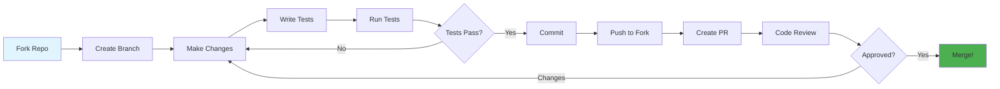
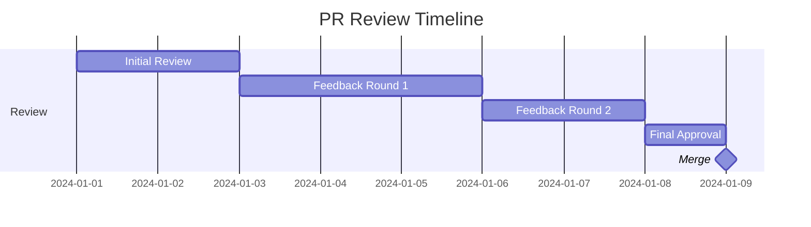

<div align="center">

# 🤝 Contributing Guide

### Join Us in Building Something Great!

[🏠 Home](README.md) • [📖 Docs](docs/USER_GUIDE.md) • [💬 Discussions](../../discussions)

---

</div>

## 🎯 Welcome Contributors!

Thank you for your interest in contributing to **Zenith**! We're excited to have you here. Whether you're fixing a bug, adding a new formatter, improving documentation, or helping others, your contributions are valuable and appreciated.

<div align="center">

### 🌟 Ways to Contribute

<table>
<tr>
<td width="25%" align="center">
<br>
<b>Code</b><br>
Fix bugs & add formatters
</td>
<td width="25%" align="center">
<br>
<b>Documentation</b><br>
Improve docs & guides
</td>
<td width="25%" align="center">
<br>
<b>Testing</b><br>
Write tests & find bugs
</td>
<td width="25%" align="center">
<br>
<b>Community</b><br>
Help & support others
</td>
</tr>
</table>

</div>

---

## 📋 Table of Contents

- [Code of Conduct](#code-of-conduct)
- [Getting Started](#getting-started)
- [Development Workflow](#development-workflow)
- [Coding Standards](#coding-standards)
- [Testing Guidelines](#testing-guidelines)
- [Documentation](#documentation)
- [Submitting Changes](#submitting-changes)
- [Review Process](#review-process)
- [Community](#community)

---

## Code of Conduct

<div align="center">

### 🤗 Be Kind and Respectful

</div>

We are committed to providing a welcoming and inclusive environment. By participating, you agree to:

<table>
<tr>
<td width="50%">

**✅ DO**
- Be respectful and considerate
- Welcome newcomers
- Accept constructive criticism
- Focus on what's best for the community
- Show empathy towards others

</td>
<td width="50%">

**❌ DON'T**
- Use offensive language
- Harass or insult others
- Publish private information
- Make personal attacks
- Disrupt discussions

</td>
</tr>
</table>

> 📜 **Full Code of Conduct:** [CODE_OF_CONDUCT.md](CODE_OF_CONDUCT.md)

---

## Getting Started

### Prerequisites

Before you begin, ensure you have:

- ✅ **Git** - Version control
- ✅ **Rust 1.75+** - Programming language
- ✅ **Cargo** - Rust package manager
- ✅ **IDE** - VS Code, IntelliJ, or similar

<details>
<summary><b>🔧 Setting Up Your Environment</b></summary>

**1. Install Rust:**
```bash
curl --proto '=https' --tlsv1.2 -sSf https://sh.rustup.rs | sh
```

**2. Install additional tools:**
```bash
# Code formatter
rustup component add rustfmt

# Linter
rustup component add clippy

# Code coverage (optional)
cargo install cargo-tarpaulin
```

**3. Verify installation:**
```bash
rustc --version
cargo --version
```

</details>

### Fork and Clone

<table>
<tr>
<td width="50%">

**1. Fork the Repository**

Click the "Fork" button on GitHub

</td>
<td width="50%">

**2. Clone Your Fork**

```bash
git clone https://github.com/YOUR_USERNAME/zenith
cd zenith
```

</td>
</tr>
<tr>
<td width="50%">

**3. Add Upstream Remote**

```bash
git remote add upstream \
  https://github.com/ORIGINAL/zenith
```

</td>
<td width="50%">

**4. Verify Remotes**

```bash
git remote -v
# origin    your-fork
# upstream  original-repo
```

</td>
</tr>
</table>

### Build and Test

```bash
# Build the project
cargo build

# Run tests
cargo test

# Run with examples
cargo run -- format --help
```

✅ **Success!** You're ready to contribute!

---

## Development Workflow

<div align="center">

### 🔄 Standard Contribution Flow

</div>



### Step-by-Step Guide

#### 1️⃣ Create a Branch

```bash
# Update your fork
git fetch upstream
git checkout main
git merge upstream/main

# Create feature branch
git checkout -b feature/your-feature-name

# Or for bug fixes
git checkout -b fix/issue-123
```

**Branch Naming:**
- `feature/` - New formatters or features
- `fix/` - Bug fixes
- `docs/` - Documentation
- `test/` - Test improvements
- `refactor/` - Code refactoring
- `zenith/` - New language zenith implementations

#### 2️⃣ Make Your Changes

<table>
<tr>
<td width="50%">

**Writing a new Zenith:**
```rust
use async_trait::async_trait;
use std::path::Path;

#[async_trait]
impl super::Zenith for MyZenith {
    fn name(&self) -> &str {
        "my-formatter"
    }

    fn extensions(&self) -> &[&str] {
        &["myext"]
    }

    async fn format(
        &self,
        content: &[u8],
        path: &Path,
        config: &ZenithConfig,
    ) -> Result<Vec<u8>> {
        // Your formatting logic
        Ok(content.to_vec())
    }
}
```

</td>
<td width="50%">

**Adding Tests:**
```rust
#[cfg(test)]
mod tests {
    use super::*;

    #[test]
    fn test_format_rust_code() {
        let input = b"fn hello(){println!(\"Hi\");}";
        let zenith = RustZenith::default();
        let result = zenith.format(input, Path::new("test.rs"), &ZenithConfig::default());
        assert!(result.is_ok());
    }
}
```

</td>
</tr>
</table>

#### 3️⃣ Test Your Changes

```bash
# Format code
cargo fmt

# Run linter
cargo clippy -- -D warnings

# Run all tests
cargo test --all-features

# Run specific test
cargo test test_format_rust_code

# Check coverage (optional)
cargo tarpaulin --out Html
```

#### 4️⃣ Commit Your Changes

**Good Commit Messages:**

```bash
# Format: <type>(<scope>): <description>

git commit -m "feat(rust): add support for Rust 2024 edition"
git commit -m "fix(cache): resolve memory leak in HashCache"
git commit -m "docs(contributing): update branch naming conventions"
git commit -m "test(zenith): add edge case tests for Python formatter"
git commit -m "refactor(batch): improve batch processing performance"
```

**Commit Types:**
- `feat` - New formatter or feature
- `fix` - Bug fix
- `docs` - Documentation
- `style` - Formatting
- `refactor` - Code restructuring
- `test` - Adding tests
- `chore` - Maintenance

<details>
<summary><b>📝 Commit Message Template</b></summary>

```
<type>(<scope>): <short summary>

<detailed description>

<footer>
```

**Example:**
```
feat(java): add support for Java record formatting

Implement formatting support for Java 16+ record types.
This includes proper indentation and spacing for record
declarations, component annotations, and derive clauses.

Closes #123
```

</details>

#### 5️⃣ Push to Your Fork

```bash
git push origin feature/your-feature-name
```

#### 6️⃣ Create Pull Request

1. Go to your fork on GitHub
2. Click "Compare & pull request"
3. Fill in the PR template
4. Link related issues
5. Submit!

---

## Coding Standards

<div align="center">

### ✨ Write Clean, Maintainable Code

</div>

### Rust Style Guide

Follow the [Rust Style Guide](https://rust-lang.github.io/api-guidelines/):

<table>
<tr>
<td width="50%">

**✅ Good**

```rust
// Descriptive names
pub async fn format_file(
    &self,
    content: &[u8],
    path: &Path,
) -> Result<Vec<u8>> {
    // Implementation
}

// Proper error handling
match self.process_content(content).await {
    Ok(formatted) => Ok(formatted),
    Err(e) => return Err(ZenithError::FormatFailed(e)),
}
```

</td>
<td width="50%">

**❌ Bad**

```rust
// Vague names
pub async fn fmt(c: &[u8], p: &Path) 
    -> Result<Vec<u8>> {
    // Implementation
}

// Ignoring errors
let result = self.process(c).await.unwrap();
```

</td>
</tr>
</table>

### Code Organization

```
src/
├── lib.rs           # Public API
├── main.rs          # CLI entrypoint
├── cli/             # CLI commands
│   ├── mod.rs
│   └── commands.rs
├── core/            # Core traits and types
│   ├── mod.rs
│   └── traits.rs    # Zenith trait definition
├── zeniths/         # Formatter implementations
│   ├── mod.rs
│   ├── registry.rs  # ZenithRegistry
│   └── impls/       # Concrete implementations
│       ├── mod.rs
│       ├── rust_zenith.rs
│       ├── python_zenith.rs
│       ├── markdown_zenith.rs
│       └── ...
├── config/          # Configuration management
│   ├── mod.rs
│   ├── types.rs
│   ├── discovery.rs
│   └── cache.rs
├── services/        # Business logic
│   ├── mod.rs
│   ├── formatter.rs
│   └── batch.rs
├── storage/         # Storage and caching
│   ├── mod.rs
│   ├── backup.rs
│   └── cache.rs
├── mcp/             # MCP server
│   ├── mod.rs
│   ├── server.rs
│   └── protocol.rs
├── plugins/         # Plugin system
│   ├── mod.rs
│   ├── loader.rs
│   └── types.rs
└── utils/           # Utilities
    ├── mod.rs
    ├── path.rs
    └── environment.rs
```

### Documentation

<details>
<summary><b>📖 Documentation Standards</b></summary>

**Every public item must have documentation:**

```rust
/// Formats Rust source code using rustfmt.
///
/// This implementation leverages the rustfmt library to provide
/// consistent formatting for Rust files. It supports all rustfmt
/// configuration options through the ZenithConfig.
///
/// # Arguments
///
/// * `content` - The raw Rust source code bytes
/// * `path` - Path to the source file (used for .rustfmt.toml lookup)
/// * `config` - Formatting configuration
///
/// # Returns
///
/// Returns the formatted source code on success.
///
/// # Errors
///
/// Returns `ZenithError::FormatterUnavailable` if rustfmt is not installed.
///
/// # Examples
///
/// ```
/// use zenith::zeniths::RustZenith;
/// use zenith::ZenithConfig;
///
/// let formatter = RustZenith::default();
/// let code = b"fn hello(){println!(\"world\");}";
/// let result = formatter.format(code, std::path::Path::new("test.rs"), &ZenithConfig::default());
/// ```
pub struct RustZenith {
    config_path: Option<PathBuf>,
    use_default: bool,
}
```

</details>

### Error Handling

```rust
// ✅ Use Result types
pub async fn format(&self, content: &[u8]) -> Result<Vec<u8>> {
    // Implementation
}

// ✅ Provide context
Err(ZenithError::FormatterFailed {
    formatter: self.name().to_string(),
    reason: format!("Unsupported extension: {}", ext),
    source: Some(e),
})

// ❌ Don't panic in library code
// panic!("Something went wrong");  // Bad!
```

---

## Testing Guidelines

<div align="center">

### 🧪 Test Everything!

</div>

### Test Categories

<table>
<tr>
<th>Type</th>
<th>Purpose</th>
<th>Location</th>
</tr>
<tr>
<td><b>Unit Tests</b></td>
<td>Test individual functions</td><td><code>src/*.rs</code> (inline)</td>
</tr>
<tr>
<td><b>Integration Tests</b></td>
<td>Test public API</td><td><code>tests/</code></td>
</tr>
<tr>
<td><b>Doc Tests</b></td>
<td>Test examples in docs</td><td>Doc comments</td>
</tr>
<tr>
<td><b>Benchmarks</b></td>
<td>Performance tests</td><td><code>benches/</code></td>
</tr>
</table>

### Writing Tests

**Unit Test Example:**

```rust
#[cfg(test)]
mod tests {
    use super::*;

    #[test]
    fn test_python_zenith_format() {
        let zenith = PythonZenith::default();
        let input = b"def  hello(  ):\n    pass";
        
        let result = zenith.format(
            input,
            Path::new("test.py"),
            &ZenithConfig::default(),
        );
        
        assert!(result.is_ok());
        let output = String::from_utf8(result.unwrap()).unwrap();
        assert!(output.contains("def hello():"));
    }

    #[test]
    fn test_unsupported_extension() {
        let registry = ZenithRegistry::default();
        let result = registry.get_by_extension("xyz");
        assert!(result.is_none());
    }
}
```

**Integration Test Example:**

```rust
// tests/integration_test.rs
use zenith::{ZenithService, AppConfig};

#[test]
fn test_full_format_workflow() {
    let config = AppConfig::default();
    let service = ZenithService::new(config);
    
    let temp_dir = tempfile::tempdir().unwrap();
    let file_path = temp_dir.path().join("test.py");
    std::fs::write(&file_path, b"print(  'hello'  )").unwrap();
    
    let results = service.format_paths(vec![file_path.to_string()]).unwrap();
    assert_eq!(results.len(), 1);
    assert!(results[0].success);
}
```

### Test Coverage

**Aim for ≥90% coverage:**

```bash
# Generate coverage report
cargo tarpaulin --out Html --output-dir coverage

# View report
open coverage/index.html
```

---

## Documentation

<div align="center">

### 📚 Documentation Matters!

</div>

### What to Document

<table>
<tr>
<td width="50%">

**Code Documentation:**
- ✅ Public functions
- ✅ Public types
- ✅ Formatter implementations
- ✅ Non-obvious behavior

</td>
<td width="50%">

**User Documentation:**
- ✅ README updates
- ✅ User guide changes
- ✅ API reference
- ✅ Examples

</td>
</tr>
</table>

### Documentation Checklist

- [ ] All public items have doc comments
- [ ] Examples compile and run
- [ ] README is updated (if needed)
- [ ] CHANGELOG is updated
- [ ] User guide reflects changes
- [ ] Migration guide (for breaking changes)

---

## Submitting Changes

<div align="center">

### 📤 Pull Request Process

</div>

### PR Template

<details>
<summary><b>📋 Pull Request Template</b></summary>

```markdown
## Description
Brief description of changes

## Type of Change
- [ ] Bug fix
- [ ] New feature (formatter/plugin/config)
- [ ] Documentation update
- [ ] Performance improvement
- [ ] Code refactoring

## Changes Made
- Change 1
- Change 2
- Change 3

## Testing
- [ ] Unit tests pass
- [ ] Integration tests pass
- [ ] Manual testing completed

## Checklist
- [ ] Code follows style guidelines
- [ ] Self-review completed
- [ ] Comments added for complex code
- [ ] Documentation updated
- [ ] No new warnings
- [ ] Tests added/updated

## Related Issues
Closes #123
```

</details>

### PR Best Practices

<table>
<tr>
<td width="50%">

**✅ Good PRs:**
- Focused on single issue
- Small, reviewable size
- Clear description
- Tests included
- Documentation updated

</td>
<td width="50%">

**❌ Avoid:**
- Multiple unrelated changes
- Huge diffs (>500 lines)
- Missing context
- No tests
- Undocumented changes

</td>
</tr>
</table>

---

## Review Process

<div align="center">

### 👀 What to Expect

</div>

### Timeline



**Typical Timeline:**
- 📧 Initial review: 1-3 days
- 💬 Feedback rounds: 2-5 days each
- ✅ Approval & merge: 1-2 days

### Review Criteria

Reviewers will check:

- ✅ **Functionality**: Does it work as intended?
- ✅ **Code Quality**: Is it clean and maintainable?
- ✅ **Tests**: Are there adequate tests?
- ✅ **Documentation**: Is it well documented?
- ✅ **Performance**: Any performance impact?
- ✅ **Compatibility**: Does it follow existing patterns?

### Responding to Feedback

```bash
# Address feedback
git add .
git commit -m "Address review comments"
git push origin feature/your-feature

# PR automatically updates!
```

---

## Community

<div align="center">

### 💬 Connect With Us

</div>

<table>
<tr>
<td width="33%" align="center">
<a href="../../discussions">
<br>
<b>Discussions</b>
</a><br>
Q&A and ideas
</td>
<td width="33%" align="center">
<a href="https://discord.gg/zenith">
<br>
<b>Discord</b>
</a><br>
Live chat
</td>
<td width="33%" align="center">
<a href="https://twitter.com/zenith">
<br>
<b>Twitter</b>
</a><br>
Updates & news
</td>
</tr>
</table>

### Recognition

We value all contributions! Contributors will be:

- 🎖️ Listed in [CONTRIBUTORS.md](CONTRIBUTORS.md)
- 🌟 Shown in README contributors section
- 💝 Mentioned in release notes

---

<div align="center">

## 🎉 Thank You!

Your contributions make this project better for everyone.

**Ready to contribute?** [Open your first issue](../../issues/new) or [start a discussion](../../discussions/new)!

---

**[🏠 Home](README.md)** • **[📖 Docs](docs/USER_GUIDE.md)** • **[💬 Chat](https://discord.gg/zenith)**

Made with ❤️ by our amazing community

[⬆ Back to Top](#-contributing-guide)
