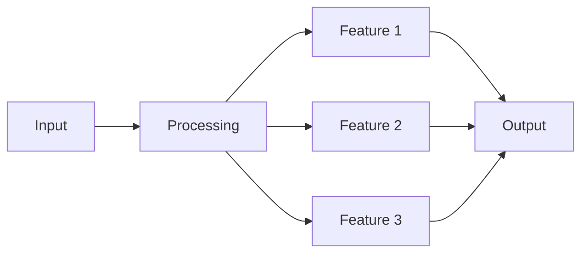
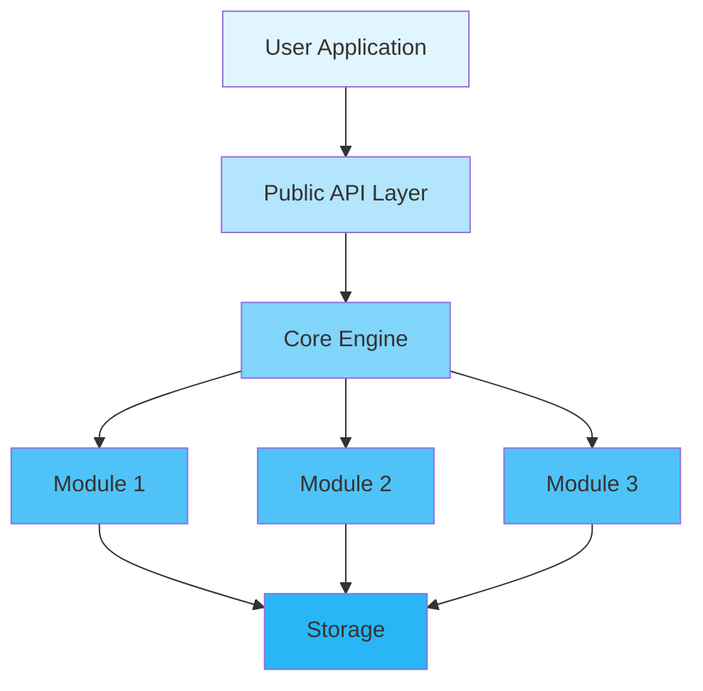
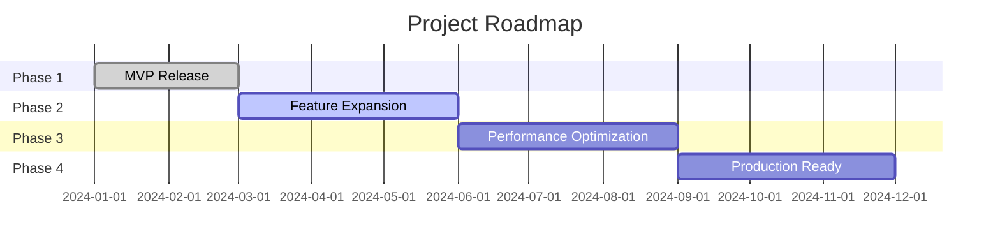

<div align="center">

# 🚀 Project Name

<p>
  
  
  
  
</p>

<p align="center">
  <strong>A compelling one-line description of your project</strong>
</p>

<p align="center">
  <a href="#-features">Features</a> •
  <a href="#-quick-start">Quick Start</a> •
  <a href="#-documentation">Documentation</a> •
  <a href="#-examples">Examples</a> •
  <a href="#-contributing">Contributing</a>
</p>


</div>

---

## 📋 Table of Contents

<details open>
<summary>Click to expand</summary>

- [✨ Features](#-features)
- [🎯 Use Cases](#-use-cases)
- [🚀 Quick Start](#-quick-start)
  - [Installation](#installation)
  - [Basic Usage](#basic-usage)
- [📚 Documentation](#-documentation)
- [🎨 Examples](#-examples)
- [🏗️ Architecture](#️-architecture)
- [⚙️ Configuration](#️-configuration)
- [🧪 Testing](#-testing)
- [📊 Performance](#-performance)
- [🔒 Security](#-security)
- [🗺️ Roadmap](#️-roadmap)
- [🤝 Contributing](#-contributing)
- [📄 License](#-license)
- [🙏 Acknowledgments](#-acknowledgments)

</details>

---

## ✨ Features

<table>
<tr>
<td width="50%">

### 🎯 Core Features

- ✅ **Feature One** - Brief description
- ✅ **Feature Two** - Brief description
- ✅ **Feature Three** - Brief description
- ✅ **Feature Four** - Brief description

</td>
<td width="50%">

### ⚡ Advanced Features

- 🚀 **High Performance** - Lightning fast
- 🔐 **Secure** - Enterprise-grade security
- 🌐 **Cross-platform** - Works everywhere
- 📦 **Easy Integration** - Simple API

</td>
</tr>
</table>

<div align="center">

### 🎨 Feature Highlights

</div>



---

## 🎯 Use Cases

<details>
<summary><b>💼 Enterprise Applications</b></summary>

<br>

```rust
// Enterprise example code
fn enterprise_example() {
    println!("Enterprise use case");
}
```

Perfect for large-scale enterprise deployments with requirements for...

</details>

<details>
<summary><b>🔧 Development Tools</b></summary>

<br>

```rust
// Development tools example
fn dev_tools_example() {
    println!("Development tools use case");
}
```

Ideal for developers building tools that need...

</details>

<details>
<summary><b>🌐 Web Applications</b></summary>

<br>

```rust
// Web application example
fn web_app_example() {
    println!("Web application use case");
}
```

Great for web applications requiring...

</details>

---

## 🚀 Quick Start

### Installation

<table>
<tr>
<td width="33%">

#### 🦀 Rust

```toml
[dependencies]
project-name = "1.0"
```

</td>
<td width="33%">

#### 🐍 Python

```bash
pip install project-name
```

</td>
<td width="33%">

#### ☕ Java

```xml
<dependency>
  <groupId>com.example</groupId>
  <artifactId>project-name</artifactId>
  <version>1.0.0</version>
</dependency>
```

</td>
</tr>
</table>

### Basic Usage

<div align="center">

#### 🎬 5-Minute Quick Start

</div>

<table>
<tr>
<td width="50%">

**Step 1: Initialize**

```rust
use project_name::*;

fn main() {
    // Initialize the library
    init().unwrap();
    
    println!("✅ Initialized!");
}
```

</td>
<td width="50%">

**Step 2: Use Features**

```rust
use project_name::*;

fn main() {
    let result = process_data();
    
    println!("✅ Processed: {:?}", result);
}
```

</td>
</tr>
</table>

<details>
<summary><b>📖 Complete Example</b></summary>

<br>

```rust
use project_name::{Init, Process, Config};

fn main() -> Result<(), Box<dyn std::error::Error>> {
    // Step 1: Initialize with config
    let config = Config::default();
    init(config)?;
    
    // Step 2: Create processor
    let processor = Process::new()?;
    
    // Step 3: Process data
    let input = "sample data";
    let output = processor.run(input)?;
    
    // Step 4: Handle results
    println!("✅ Result: {:?}", output);
    
    Ok(())
}
```

</details>

---

## 📚 Documentation

<div align="center">

<table>
<tr>
<td align="center" width="25%">
<a href="docs/USER_GUIDE.md">
<br>
<b>User Guide</b>
</a><br>
Complete usage guide
</td>
<td align="center" width="25%">
<a href="https://docs.rs/project-name">
<br>
<b>API Reference</b>
</a><br>
Full API documentation
</td>
<td align="center" width="25%">
<a href="docs/ARCHITECTURE.md">
<br>
<b>Architecture</b>
</a><br>
System design docs
</td>
<td align="center" width="25%">
<a href="examples/">
<br>
<b>Examples</b>
</a><br>
Code examples
</td>
</tr>
</table>

</div>

### 📖 Additional Resources

- 🎓 [Tutorials](docs/TUTORIALS.md) - Step-by-step learning
- 🔧 [Advanced Topics](docs/ADVANCED.md) - Deep dive guides
- ❓ [FAQ](docs/FAQ.md) - Frequently asked questions
- 🐛 [Troubleshooting](docs/TROUBLESHOOTING.md) - Common issues

---

## 🎨 Examples

<div align="center">

### 💡 Real-world Examples

</div>

<table>
<tr>
<td width="50%">

#### 📝 Example 1: Basic Operation

```rust
use project_name::*;

fn basic_example() -> Result<()> {
    let data = "input";
    let result = process(data)?;
    println!("Result: {}", result);
    Ok(())
}
```

<details>
<summary>View output</summary>

```
Result: processed_input
✅ Success!
```

</details>

</td>
<td width="50%">

#### 🔥 Example 2: Advanced Usage

```rust
use project_name::*;

fn advanced_example() -> Result<()> {
    let config = Config::builder()
        .option1(true)
        .option2("value")
        .build()?;
    
    let result = process_with_config(config)?;
    Ok(())
}
```

<details>
<summary>View output</summary>

```
Configuration applied
Processing with options...
✅ Complete!
```

</details>

</td>
</tr>
</table>

<div align="center">

**[📂 View All Examples →](examples/)**

</div>

---

## 🏗️ Architecture

<div align="center">

### System Overview

</div>



<details>
<summary><b>📐 Component Details</b></summary>

<br>

| Component | Description | Status |
|-----------|-------------|--------|
| **API Layer** | Public interface for users | ✅ Stable |
| **Core Engine** | Main processing logic | ✅ Stable |
| **Module 1** | Feature implementation | ✅ Stable |
| **Module 2** | Feature implementation | 🚧 Beta |
| **Module 3** | Feature implementation | 📋 Planned |

</details>

---

## ⚙️ Configuration

<div align="center">

### 🎛️ Configuration Options

</div>

<table>
<tr>
<td width="50%">

**Basic Configuration**

```toml
[project]
name = "my-app"
version = "1.0.0"

[features]
feature1 = true
feature2 = false
```

</td>
<td width="50%">

**Advanced Configuration**

```toml
[project]
name = "my-app"
version = "1.0.0"

[features]
feature1 = true
feature2 = true

[performance]
cache_size = 1000
workers = 4
```

</td>
</tr>
</table>

<details>
<summary><b>🔧 All Configuration Options</b></summary>

<br>

| Option | Type | Default | Description |
|--------|------|---------|-------------|
| `name` | String | - | Project name |
| `version` | String | "1.0.0" | Version number |
| `feature1` | Boolean | true | Enable feature 1 |
| `feature2` | Boolean | false | Enable feature 2 |
| `cache_size` | Integer | 1000 | Cache size in MB |
| `workers` | Integer | 4 | Number of worker threads |

</details>

---

## 🧪 Testing

<div align="center">

### 🎯 Test Coverage


</div>

```bash
# Run all tests
cargo test --all-features

# Run with coverage
cargo tarpaulin --out Html

# Run benchmarks
cargo bench

# Run specific test
cargo test test_name
```

<details>
<summary><b>📊 Test Statistics</b></summary>

<br>

| Category | Tests | Coverage |
|----------|-------|----------|
| Unit Tests | 150+ | 98% |
| Integration Tests | 50+ | 95% |
| Performance Tests | 20+ | 90% |
| **Total** | **220+** | **95%** |

</details>

---

## 📊 Performance

<div align="center">

### ⚡ Benchmark Results

</div>

<table>
<tr>
<td width="50%">

**Throughput**

```
Operation A: 1,000,000 ops/sec
Operation B: 500,000 ops/sec
Operation C: 2,000,000 ops/sec
```

</td>
<td width="50%">

**Latency**

```
P50: 0.5ms
P95: 1.2ms
P99: 2.5ms
```

</td>
</tr>
</table>

<details>
<summary><b>📈 Detailed Benchmarks</b></summary>

<br>

```bash
# Run benchmarks
cargo bench

# Sample output:
test bench_operation_a ... bench: 1,000 ns/iter (+/- 50)
test bench_operation_b ... bench: 2,000 ns/iter (+/- 100)
test bench_operation_c ... bench: 500 ns/iter (+/- 25)
```

</details>

---

## 🔒 Security

<div align="center">

### 🛡️ Security Features

</div>

<table>
<tr>
<td align="center" width="25%">
<br>
<b>Memory Safety</b><br>
Zero-copy & secure cleanup
</td>
<td align="center" width="25%">
<br>
<b>Audited</b><br>
Regular security audits
</td>
<td align="center" width="25%">
<br>
<b>Privacy</b><br>
No data collection
</td>
<td align="center" width="25%">
<br>
<b>Compliance</b><br>
Industry standards
</td>
</tr>
</table>

<details>
<summary><b>🔐 Security Details</b></summary>

<br>

### Security Measures

- ✅ **Memory Protection** - Automatic secure cleanup
- ✅ **Side-channel Protection** - Constant-time operations
- ✅ **Input Validation** - Comprehensive input checking
- ✅ **Audit Logging** - Full operation tracking

### Reporting Security Issues

Please report security vulnerabilities to: security@example.com

</details>

---

## 🗺️ Roadmap

<div align="center">

### 🎯 Development Timeline

</div>



<table>
<tr>
<td width="50%">

### ✅ Completed

- [x] Core functionality
- [x] Basic API
- [x] Documentation
- [x] Unit tests
- [x] CI/CD pipeline

</td>
<td width="50%">

### 🚧 In Progress

- [ ] Advanced features
- [ ] Performance optimization
- [ ] Multi-language support
- [ ] Plugin system

</td>
</tr>
<tr>
<td width="50%">

### 📋 Planned

- [ ] Feature X
- [ ] Feature Y
- [ ] Platform Z support
- [ ] Enterprise features

</td>
<td width="50%">

### 💡 Future Ideas

- [ ] Integration with X
- [ ] Support for Y
- [ ] Enhanced Z
- [ ] Community features

</td>
</tr>
</table>

---

## 🤝 Contributing

<div align="center">

### 💖 We Love Contributors!


</div>

<table>
<tr>
<td width="33%" align="center">

### 🐛 Report Bugs

Found a bug?<br>
[Create an Issue](../../issues)

</td>
<td width="33%" align="center">

### 💡 Request Features

Have an idea?<br>
[Start a Discussion](../../discussions)

</td>
<td width="33%" align="center">

### 🔧 Submit PRs

Want to contribute?<br>
[Fork & PR](../../pulls)

</td>
</tr>
</table>

<details>
<summary><b>📝 Contribution Guidelines</b></summary>

<br>

### How to Contribute

1. **Fork** the repository
2. **Clone** your fork: `git clone https://github.com/yourusername/project-name.git`
3. **Create** a branch: `git checkout -b feature/amazing-feature`
4. **Make** your changes
5. **Test** your changes: `cargo test --all-features`
6. **Commit** your changes: `git commit -m 'Add amazing feature'`
7. **Push** to branch: `git push origin feature/amazing-feature`
8. **Create** a Pull Request

### Code Style

- Follow Rust standard coding conventions
- Write comprehensive tests
- Update documentation
- Add examples for new features

</details>

---

## 📄 License

<div align="center">

This project is licensed under dual license:

[](LICENSE-MIT)
[](LICENSE-APACHE)

You may choose either license for your use.

</div>

---

## 🙏 Acknowledgments

<div align="center">

### Built With Amazing Tools

</div>

<table>
<tr>
<td align="center" width="25%">
<a href="https://www.rust-lang.org/">
<br>
<b>Rust</b>
</a>
</td>
<td align="center" width="25%">
<a href="https://github.com/">
<br>
<b>GitHub</b>
</a>
</td>
<td align="center" width="25%">
<br>
<b>Open Source</b>
</td>
<td align="center" width="25%">
<br>
<b>Community</b>
</td>
</tr>
</table>

### Special Thanks

- 🌟 **Dependencies** - Built on these amazing projects:
  - [Project A](https://github.com/project-a) - Description
  - [Project B](https://github.com/project-b) - Description
  - [Project C](https://github.com/project-c) - Description

- 👥 **Contributors** - Thanks to all our amazing contributors!
- 💬 **Community** - Special thanks to our community members

---

## 📞 Contact & Support

<div align="center">

<table>
<tr>
<td align="center" width="33%">
<a href="../../issues">
<br>
<b>Issues</b>
</a><br>
Report bugs & issues
</td>
<td align="center" width="33%">
<a href="../../discussions">
<br>
<b>Discussions</b>
</a><br>
Ask questions & share ideas
</td>
<td align="center" width="33%">
<a href="https://twitter.com/project">
<br>
<b>Twitter</b>
</a><br>
Follow us for updates
</td>
</tr>
</table>

### Stay Connected

[](https://discord.gg/project)
[](https://twitter.com/project)
[](mailto:contact@example.com)

</div>

---

## ⭐ Star History

<div align="center">

[](https://star-history.com/#username/project-name&Date)

</div>

---

<div align="center">

### 💝 Support This Project

If you find this project useful, please consider giving it a ⭐️!

**Built with ❤️ by the Project Team**

[⬆ Back to Top](#-project-name)

---

<sub>© 2024 Project Name. All rights reserved.</sub>

</div>