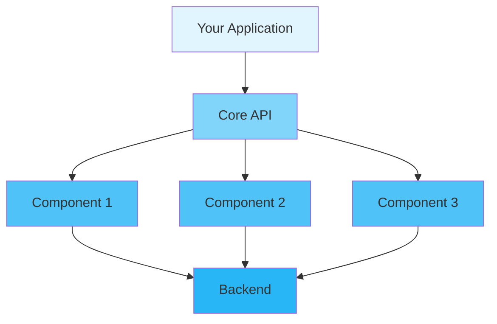

<div align="center">

# 📖 User Guide

### Complete Guide to Using Project Name

[🏠 Home](../README.md) • [📚 Docs](README.md) • [🎯 Examples](../examples/) • [❓ FAQ](FAQ.md)

---

</div>

## 📋 Table of Contents

- [Introduction](#introduction)
- [Getting Started](#getting-started)
  - [Prerequisites](#prerequisites)
  - [Installation](#installation)
  - [First Steps](#first-steps)
- [Core Concepts](#core-concepts)
- [Basic Usage](#basic-usage)
  - [Initialization](#initialization)
  - [Configuration](#configuration)
  - [Basic Operations](#basic-operations)
- [Advanced Usage](#advanced-usage)
  - [Custom Configuration](#custom-configuration)
  - [Performance Tuning](#performance-tuning)
  - [Error Handling](#error-handling)
- [Best Practices](#best-practices)
- [Common Patterns](#common-patterns)
- [Troubleshooting](#troubleshooting)
- [Next Steps](#next-steps)

---

## Introduction

<div align="center">

### 🎯 What You'll Learn

</div>

<table>
<tr>
<td width="25%" align="center">
<br>
<b>Quick Start</b><br>
Get up and running in 5 minutes
</td>
<td width="25%" align="center">
<br>
<b>Configuration</b><br>
Customize to your needs
</td>
<td width="25%" align="center">
<br>
<b>Best Practices</b><br>
Learn the right way
</td>
<td width="25%" align="center">
<br>
<b>Advanced Topics</b><br>
Master the details
</td>
</tr>
</table>

**Project Name** is designed to help you accomplish [primary goal]. This guide will walk you through everything from basic setup to advanced usage patterns.

> 💡 **Tip**: This guide assumes basic knowledge of [prerequisite]. If you're new to [topic], check out our [Beginner's Tutorial](TUTORIALS.md) first.

---

## Getting Started

### Prerequisites

Before you begin, ensure you have the following installed:

<table>
<tr>
<td width="50%">

**Required**
- ✅ Rust 1.75+ (stable)
- ✅ Cargo (comes with Rust)
- ✅ Git

</td>
<td width="50%">

**Optional**
- 🔧 IDE with Rust support
- 🔧 Docker (for containerized deployment)
- 🔧 [Additional tool]

</td>
</tr>
</table>

<details>
<summary><b>🔍 Verify Your Installation</b></summary>

```bash
# Check Rust version
rustc --version
# Expected: rustc 1.75.0 (or higher)

# Check Cargo version
cargo --version
# Expected: cargo 1.75.0 (or higher)

# Check Git version
git --version
# Expected: git version 2.x.x
```

</details>

### Installation

<div align="center">

#### Choose Your Installation Method

</div>

<table>
<tr>
<td width="50%">

**📦 Using Cargo (Recommended)**

```bash
# Add to Cargo.toml
[dependencies]
project-name = "1.0"

# Or install via command
cargo add project-name
```

</td>
<td width="50%">

**🐙 From Source**

```bash
git clone https://github.com/user/project-name
cd project-name
cargo build --release
```

</td>
</tr>
</table>

<details>
<summary><b>🌐 Other Installation Methods</b></summary>

**Using Docker**
```bash
docker pull project-name:latest
docker run -it project-name
```

**Using Homebrew (macOS)**
```bash
brew install project-name
```

**Using Chocolatey (Windows)**
```powershell
choco install project-name
```

</details>

### First Steps

Let's verify your installation with a simple "Hello World":

```rust
use project_name::*;

fn main() -> Result<(), Box<dyn std::error::Error>> {
    // Initialize the library
    init()?;
    
    println!("✅ Project Name is ready!");
    
    Ok(())
}
```

<details>
<summary><b>🎬 Run the Example</b></summary>

```bash
# Create a new project
cargo new hello-project
cd hello-project

# Add dependency
cargo add project-name

# Copy the code above to src/main.rs

# Run it!
cargo run
```

**Expected Output:**
```
✅ Project Name is ready!
```

</details>

---

## Core Concepts

Understanding these core concepts will help you use the library effectively.

<div align="center">

### 🧩 Key Components

</div>



### 1️⃣ Concept One: [Name]

**What it is:** Brief description of the concept.

**Why it matters:** Explanation of importance.

**Example:**
```rust
// Demonstration code
let example = ConceptOne::new();
```

<details>
<summary><b>📚 Learn More</b></summary>

Detailed explanation of the concept, including:
- How it works internally
- When to use it
- Common pitfalls
- Related concepts

</details>

### 2️⃣ Concept Two: [Name]

**What it is:** Brief description.

**Key Features:**
- ✅ Feature A
- ✅ Feature B
- ✅ Feature C

**Example:**
```rust
let concept = ConceptTwo::builder()
    .option_a(value)
    .option_b(value)
    .build()?;
```

### 3️⃣ Concept Three: [Name]

<table>
<tr>
<td width="50%">

**Traditional Approach**
```rust
// Old way
let result = old_method(data);
```

</td>
<td width="50%">

**Our Approach**
```rust
// Better way
let result = new_method(data)?;
```

</td>
</tr>
</table>

---

## Basic Usage

### Initialization

Every application must initialize the library before use:

```rust
use project_name::{init, Config};

fn main() -> Result<(), Box<dyn std::error::Error>> {
    // Simple initialization
    init()?;
    
    // Or with custom config
    let config = Config::default();
    init_with_config(config)?;
    
    Ok(())
}
```

<div align="center">

| Method | Use Case | Performance | Complexity |
|--------|----------|-------------|------------|
| `init()` | Quick start, development | ⚡ Fast | 🟢 Simple |
| `init_with_config()` | Production, custom needs | ⚡⚡ Optimized | 🟡 Moderate |

</div>

### Configuration

<details open>
<summary><b>⚙️ Configuration Options</b></summary>

```rust
use project_name::Config;

let config = Config::builder()
    // Feature toggles
    .enable_feature_a(true)
    .enable_feature_b(false)
    
    // Performance settings
    .thread_pool_size(4)
    .cache_size(1024)
    
    // Logging
    .log_level("info")
    .log_file("/var/log/app.log")
    
    .build()?;
```

</details>

<table>
<tr>
<th>Option</th>
<th>Type</th>
<th>Default</th>
<th>Description</th>
</tr>
<tr>
<td><code>enable_feature_a</code></td>
<td>bool</td>
<td>true</td>
<td>Enable feature A functionality</td>
</tr>
<tr>
<td><code>thread_pool_size</code></td>
<td>usize</td>
<td>4</td>
<td>Number of worker threads</td>
</tr>
<tr>
<td><code>cache_size</code></td>
<td>usize</td>
<td>1024</td>
<td>Cache size in MB</td>
</tr>
<tr>
<td><code>log_level</code></td>
<td>String</td>
<td>"info"</td>
<td>Logging verbosity (debug/info/warn/error)</td>
</tr>
</table>

### Basic Operations

<div align="center">

#### 📝 CRUD Operations

</div>

<table>
<tr>
<td width="50%">

**Create**
```rust
let item = Item::new("name", data)?;
item.save()?;
```

**Read**
```rust
let item = Item::load("id")?;
println!("Data: {:?}", item.data());
```

</td>
<td width="50%">

**Update**
```rust
item.set_data(new_data)?;
item.save()?;
```

**Delete**
```rust
item.delete()?;
```

</td>
</tr>
</table>

<details>
<summary><b>🎯 Complete Example</b></summary>

```rust
use project_name::{init, Item};

fn main() -> Result<(), Box<dyn std::error::Error>> {
    init()?;
    
    // Create
    let mut item = Item::new("user-123", b"user data")?;
    item.save()?;
    println!("✅ Created item: {}", item.id());
    
    // Read
    let loaded = Item::load("user-123")?;
    println!("📖 Loaded: {:?}", loaded.data());
    
    // Update
    loaded.set_data(b"updated data")?;
    loaded.save()?;
    println!("✏️ Updated item");
    
    // Delete
    loaded.delete()?;
    println!("🗑️ Deleted item");
    
    Ok(())
}
```

</details>

---

## Advanced Usage

### Custom Configuration

For production environments, you'll want fine-grained control:

```rust
use project_name::{Config, PerformanceProfile};

let config = Config::builder()
    // Production settings
    .environment("production")
    .performance_profile(PerformanceProfile::HighThroughput)
    
    // Security
    .enable_encryption(true)
    .key_rotation_interval(Duration::from_secs(86400))
    
    // Monitoring
    .enable_metrics(true)
    .metrics_endpoint("http://metrics.example.com")
    
    // Resilience
    .retry_policy(RetryPolicy::exponential_backoff())
    .timeout(Duration::from_secs(30))
    
    .build()?;

init_with_config(config)?;
```

<details>
<summary><b>🎛️ Performance Profiles</b></summary>

<table>
<tr>
<th>Profile</th>
<th>Use Case</th>
<th>Throughput</th>
<th>Latency</th>
<th>Memory</th>
</tr>
<tr>
<td><b>LowLatency</b></td>
<td>Real-time apps</td>
<td>Medium</td>
<td>⚡ Very Low</td>
<td>High</td>
</tr>
<tr>
<td><b>HighThroughput</b></td>
<td>Batch processing</td>
<td>⚡ Very High</td>
<td>Medium</td>
<td>Medium</td>
</tr>
<tr>
<td><b>Balanced</b></td>
<td>General purpose</td>
<td>High</td>
<td>Low</td>
<td>Medium</td>
</tr>
<tr>
<td><b>LowMemory</b></td>
<td>Resource-constrained</td>
<td>Low</td>
<td>Medium</td>
<td>⚡ Very Low</td>
</tr>
</table>

</details>

### Performance Tuning

<div align="center">

#### ⚡ Optimization Strategies

</div>

**1. Connection Pooling**

```rust
let config = Config::builder()
    .connection_pool_size(20)
    .connection_pool_timeout(Duration::from_secs(5))
    .build()?;
```

**2. Batch Operations**

<table>
<tr>
<td width="50%">

❌ **Inefficient**
```rust
for item in items {
    process_one(item)?;
}
```

</td>
<td width="50%">

✅ **Efficient**
```rust
process_batch(&items)?;
```

</td>
</tr>
</table>

**3. Caching**

```rust
use project_name::cache::Cache;

let cache = Cache::builder()
    .max_size(10_000)
    .ttl(Duration::from_secs(3600))
    .build()?;

// Use cache
if let Some(value) = cache.get("key")? {
    return Ok(value);
}

let value = expensive_operation()?;
cache.set("key", value.clone())?;
```

### Error Handling

<div align="center">

#### 🚨 Handling Errors Gracefully

</div>

```rust
use project_name::{Error, ErrorKind};

fn handle_operation() -> Result<(), Error> {
    match risky_operation() {
        Ok(result) => {
            println!("Success: {:?}", result);
            Ok(())
        }
        Err(e) => {
            match e.kind() {
                ErrorKind::NotFound => {
                    println!("⚠️ Resource not found, creating new...");
                    create_resource()?;
                    Ok(())
                }
                ErrorKind::PermissionDenied => {
                    eprintln!("❌ Access denied");
                    Err(e)
                }
                ErrorKind::Timeout => {
                    println!("⏱️ Timeout, retrying...");
                    retry_operation()?;
                    Ok(())
                }
                _ => {
                    eprintln!("❌ Unexpected error: {}", e);
                    Err(e)
                }
            }
        }
    }
}
```

<details>
<summary><b>📋 Error Types</b></summary>

| Error Type | Description | Recovery Strategy |
|------------|-------------|-------------------|
| `NotFound` | Resource doesn't exist | Create or use default |
| `AlreadyExists` | Duplicate resource | Use existing or update |
| `PermissionDenied` | Access violation | Request permissions |
| `Timeout` | Operation took too long | Retry with backoff |
| `InvalidInput` | Bad parameters | Validate and retry |
| `InternalError` | System failure | Log and alert |

</details>

---

## Best Practices

<div align="center">

### 🌟 Follow These Guidelines

</div>

### ✅ DO's

<table>
<tr>
<td width="50%">

**Initialize Early**
```rust
fn main() {
    // Initialize at the start
    project_name::init().unwrap();
    
    // Then use the library
    do_work();
}
```

</td>
<td width="50%">

**Use Builder Pattern**
```rust
let config = Config::builder()
    .option_a(value)
    .option_b(value)
    .build()?;
```

</td>
</tr>
<tr>
<td width="50%">

**Handle Errors Properly**
```rust
match operation() {
    Ok(result) => process(result),
    Err(e) => handle_error(e),
}
```

</td>
<td width="50%">

**Clean Up Resources**
```rust
{
    let resource = acquire()?;
    use_resource(&resource)?;
    // Auto-cleanup on scope exit
}
```

</td>
</tr>
</table>

### ❌ DON'Ts

<table>
<tr>
<td width="50%">

**Don't Ignore Errors**
```rust
// ❌ Bad
let _ = operation();

// ✅ Good
operation()?;
```

</td>
<td width="50%">

**Don't Block Async Context**
```rust
// ❌ Bad (in async fn)
thread::sleep(duration);

// ✅ Good
tokio::time::sleep(duration).await;
```

</td>
</tr>
</table>

### 💡 Tips and Tricks

> **🔥 Performance Tip**: Enable release mode optimizations for production:
> ```bash
> cargo build --release
> ```

> **🔒 Security Tip**: Never hardcode sensitive data:
> ```rust
> // ❌ Bad
> let api_key = "sk-1234567890";
> 
> // ✅ Good
> let api_key = env::var("API_KEY")?;
> ```

> **📊 Monitoring Tip**: Enable metrics in production:
> ```rust
> Config::builder().enable_metrics(true).build()?
> ```

---

## Common Patterns

### Pattern 1: Request-Response

```rust
use project_name::{Request, Response};

fn handle_request(req: Request) -> Result<Response, Error> {
    // Validate
    req.validate()?;
    
    // Process
    let data = process(req.data())?;
    
    // Respond
    Ok(Response::success(data))
}
```

### Pattern 2: Worker Pool

```rust
use project_name::WorkerPool;

let pool = WorkerPool::new(4)?;

for task in tasks {
    pool.execute(move || {
        process_task(task)
    })?;
}

pool.wait_completion()?;
```

### Pattern 3: Pipeline

```rust
use project_name::Pipeline;

let result = Pipeline::new()
    .add_stage(validate)
    .add_stage(transform)
    .add_stage(process)
    .add_stage(store)
    .execute(input)?;
```

---

## Troubleshooting

<details>
<summary><b>❓ Problem: Initialization fails with "already initialized"</b></summary>

**Solution:**
```rust
// Check if already initialized
if !project_name::is_initialized() {
    project_name::init()?;
}
```

</details>

<details>
<summary><b>❓ Problem: Performance is slower than expected</b></summary>

**Diagnosis:**
1. Enable debug logging
2. Check configuration settings
3. Profile your application

**Solution:**
```rust
// Use performance profile
let config = Config::builder()
    .performance_profile(PerformanceProfile::HighThroughput)
    .build()?;
```

</details>

<details>
<summary><b>❓ Problem: Memory usage is high</b></summary>

**Solution:**
```rust
// Reduce cache size
let config = Config::builder()
    .cache_size(512)  // Reduce from default
    .build()?;
```

</details>

<div align="center">

**💬 Still need help?** [Open an issue](../../issues) or [join our Discord](https://discord.gg/project)

</div>

---

## Next Steps

<div align="center">

### 🎯 Continue Your Journey

</div>

<table>
<tr>
<td width="33%" align="center">
<a href="TUTORIALS.md">
<br>
<b>📚 Tutorials</b>
</a><br>
Step-by-step learning
</td>
<td width="33%" align="center">
<a href="ADVANCED.md">
<br>
<b>🔧 Advanced Topics</b>
</a><br>
Deep dive into features
</td>
<td width="33%" align="center">
<a href="../examples/">
<br>
<b>💻 Examples</b>
</a><br>
Real-world code samples
</td>
</tr>
</table>

---

<div align="center">

**[📖 API Reference](https://docs.rs/project-name)** • **[❓ FAQ](FAQ.md)** • **[🐛 Report Issue](../../issues)**

Made with ❤️ by the Project Team

[⬆ Back to Top](#-user-guide)

</div>