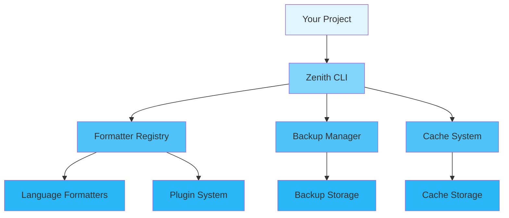

<div align="center">

# 📖 Zenith User Guide

## 📋 Table of Contents

- [Introduction](#introduction)
- [Getting Started](#getting-started)
  - [Prerequisites](#prerequisites)
  - [Installation](#installation)
  - [First Steps](#first-steps)
- [Core Concepts](#core-concepts)
- [Basic Usage](#basic-usage)
  - [Initialization](#initialization)
  - [Configuration](#configuration)
  - [Basic Operations](#basic-operations)
- [Advanced Usage](#advanced-usage)
  - [Custom Configuration](#custom-configuration)
  - [Performance Tuning](#performance-tuning)
  - [Error Handling](#error-handling)
- [Best Practices](#best-practices)
- [Common Patterns](#common-patterns)
- [Troubleshooting](#troubleshooting)
- [Next Steps](#next-steps)

---

## Introduction

<div align="center">

### 🎯 What You'll Learn

</div>

<table>
<tr>
<td width="25%" align="center">
<br>
<b>Quick Start</b><br>
Get up and running in 5 minutes
</td>
<td width="25%" align="center">
<br>
<b>Configuration</b><br>
Customize to your needs
</td>
<td width="25%" align="center">
<br>
<b>Best Practices</b><br>
Learn the right way
</td>
<td width="25%" align="center">
<br>
<b>Advanced Topics</b><br>
Master the details
</td>
</tr>
</table>

**Zenith** is a high-performance, multi-language code formatter with
automatic backup and one-click recovery. This guide will walk you through
everything from basic setup to advanced usage patterns.

> 💡 **Tip**: This guide assumes basic knowledge of command-line tools. If you're new
to code formatters, check out our [Quick Start](#first-steps) section first.

---

## Getting Started

### Prerequisites

Before you begin, ensure you have the following installed:

<table>
<tr>
<td width="50%">

### Required

- ✅ Rust 1.75+ (stable)
- ✅ Cargo (comes with Rust)
- ✅ Git

</td>
<td width="50%">

### Optional

- 🔧 IDE with Rust support
- 🔧 Formatter tools (rustfmt, ruff, prettier, etc.)
- 🔧 Docker (for containerized deployment)

</td>
</tr>
</table>

<details>
<summary><b>🔍 Verify Your Installation</b></summary>

```bash
# Check Rust version
rustc --version
# Expected: rustc 1.75.0 (or higher)

# Check Cargo version
cargo --version
# Expected: cargo 1.75.0 (or higher)

# Check Git version
git --version
# Expected: git version 2.x.x
```

</details>

### Installation

<div align="center">

#### Choose Your Installation Method

</div>

<table>
<tr>
<td width="50%">

### 📦 Using Cargo Install (Recommended)

```bash
cargo install --git https://github.com/Kirky-X/zenith.git
```

</td>
<td width="50%">

### 🐙 From Source

```bash
git clone https://github.com/Kirky-X/zenith.git
cd zenith
cargo build --release
```

</td>
</tr>
</table>

<details>
<summary><b>🌐 Other Installation Methods</b></summary>

### Quick Install Script (Linux/macOS)

```bash
curl -sSL https://raw.githubusercontent.com/Kirky-X/zenith/main/install.sh | sh
```

### Windows (PowerShell)

```powershell
iwr -useb https://raw.githubusercontent.com/Kirky-X/zenith/main/install.ps1 | iex
```

### Pre-compiled Binaries

1. Visit [Releases](https://github.com/Kirky-X/zenith/releases)
2. Download the binary for your platform
3. Extract and add to PATH:

```bash
tar -xzf zenith-v0.1.0-linux-x86_64.tar.gz
sudo mv zenith /usr/local/bin/
```

</details>

### First Steps

Let's verify your installation:

```bash
# Check version
zenith --version
# Output: zenith 0.1.0

# Show help
zenith --help
# Show all available commands

# Initialize configuration
zenith init

# Check environment
zenith doctor
```

<details>
<summary><b>🎬 Quick Start Example</b></summary>

```bash
# Format a single file
zenith format src/main.rs

# Format a directory
zenith format src/

# Format recursively
zenith format ./ --recursive

# Check mode (no changes)
zenith format src/ --check
```

</details>

---

## Core Concepts

Understanding these core concepts will help you use Zenith effectively.

<div align="center">

### 🧩 Key Components

</div>



### 1️⃣ Formatter Registry

**What it is:** A centralized registry that manages all supported code formatters.

**Why it matters:** Provides unified interface for different language formatters with automatic detection.

**Key Features:**

- ✅ Automatic language detection
- ✅ Plugin-based architecture
- ✅ 14+ language support

**Example:**

```bash
# Auto-detect and format
zenith format src/main.rs

# Force specific formatter
zenith format src/main.py --formatter ruff
```

<details>
<summary><b>📚 Learn More</b></summary>

The formatter registry:

- Automatically detects file type by extension
- Loads appropriate formatter based on configuration
- Supports plugin system for custom formatters
- Falls back to built-in formatters when unavailable

</details>

### 2️⃣ Backup System

**What it is:** Automatic backup system that preserves original code before formatting.

**Why it matters:** Provides safety net for accidental formatting or
unwanted changes.

**Key Features:**

- ✅ Automatic backups before formatting
- ✅ Versioned backup storage
- ✅ One-click recovery
- ✅ Configurable retention

**Example:**

```bash
# Automatic backup is enabled by default
zenith format src/

# List available backups
zenith list-backups

# Restore from backup
zenith recover backup_20231223_142030
```

### 3️⃣ Cache System

**What it is:** Intelligent caching system that tracks file changes and avoids reformatting unchanged files.

**Why it matters:** Significantly improves performance for large projects by skipping already-formatted files.

<table>
<tr>
<td width="50%">

### Without Cache

```bash
# Re-formats all files every time
zenith format ./ --recursive
# Time: 10s (all files)
```

</td>
<td width="50%">

### With Cache

```bash
# Only reformats changed files
zenith format ./ --recursive
# Time: 1s (only changed files)
```

</td>
</tr>
</table>

---

## Basic Usage

### Initialization

Every project should initialize Zenith configuration:

```bash
# Simple initialization
zenith init

# Overwrite existing configuration
zenith init --force
```

<div align="center">

| Method | Use Case | Performance | Complexity |
|--------|----------|-------------|------------|
| `init()` | Quick start, new projects | ⚡ Fast | 🟢 Simple |
| `init --force` | Reset configuration | ⚡ Fast | 🟢 Simple |

</div>

### Configuration

<details open>
<summary><b>⚙️ Configuration Options</b></summary>

**Configuration File Location:**

Zenith looks for configuration files in the following order (first found wins):

1. `./zenith.toml` (current directory)
2. `~/.config/zenith/config.toml` (user config)
3. `/etc/zenith/config.toml` (system config)

**Create `zenith.toml`:**

```toml
[global]
backup_enabled = true
log_level = "info"
recursive = true
cache_enabled = true

[formatters.rust]
enabled = true
use_default = true

[formatters.python]
enabled = true
use_default = true

[formatters.markdown]
enabled = true
use_default = true

[formatters.json]
enabled = true
```

```toml
[global]
backup_enabled = true
log_level = "info"
recursive = true
cache_enabled = true
config_dir = ".zenith"

[zeniths.rust]
enabled = true
config_path = ".rustfmt.toml"
use_default = true

[zeniths.python]
enabled = true
config_path = "pyproject.toml"
use_default = true

[zeniths.markdown]
enabled = true
use_default = true

[zeniths.json]
enabled = true

[concurrency]
workers = 8
batch_size = 100

[backup]
dir = ".zenith_backup"
retention_days = 7

[limits]
max_file_size_mb = 10
max_memory_mb = 512

[mcp]
enabled = false
host = "127.0.0.1"
port = 9000
auth_enabled = false
api_key = null
allowed_origins = ["*"]
users = []

[security]
allowed_plugin_commands = []
allow_absolute_paths = false
allow_relative_paths = false
```

</details>

| Option | Type | Default | Description |
|--------|------|---------|-------------|
| `backup_enabled` | bool | true | Enable automatic backups before formatting |
| `log_level` | String | "info" | Logging verbosity (debug/info/warn/error) |
| `recursive` | bool | false | Process directories recursively |
| `cache_enabled` | bool | true | Enable caching for performance |
| `workers` | usize | 8 | Number of concurrent workers |

</table>

**Environment Variables:**

Override configuration with environment variables:

```bash
export ZENITH_WORKERS=16
export ZENITH_LOG_LEVEL=debug
export ZENITH_NO_BACKUP=false
export ZENITH_RECURSIVE=true
export ZENITH_CACHE_ENABLED=true
export ZENITH_BACKUP_DIR=".zenith_backup"
export ZENITH_MCP_ENABLED=true
```

### Basic Operations

<div align="center">

#### 📝 Core Operations

</div>

<table>
<tr>
<td width="50%">

### Format Files

```bash
# Single file
zenith format src/main.rs

# Directory
zenith format src/

# Recursively
zenith format ./ --recursive

# Check mode
zenith format src/ --check
```

</td>
<td width="50%">

### Backup Operations

```bash
# List backups
zenith list-backups

# Restore backup
zenith recover backup_id

# Clean old backups
zenith clean-backups --days 7
```

</td>
</tr>
</table>

<details>
<summary><b>🎯 Complete Workflow Example</b></summary>

```bash
# 1. Initialize project
zenith init

# 2. Check environment
zenith doctor

# 3. Format project
zenith format ./ --recursive

# 4. List changes
zenith list-backups

# 5. If issues, recover
zenith recover backup_20231223_142030
```

</details>

---

## Advanced Usage

### Custom Configuration

For production environments, you'll want fine-grained control:

```bash
# High performance settings
zenith format ./ --recursive --workers 32 --verbose

# Disable backup for CI
zenith format ./ --recursive --no-backup

# Selective formatting
zenith format src/ --exclude target --exclude node_modules
```

<details>
<summary><b>🎛️ Performance Profiles</b></summary>

| Profile | Use Case | Throughput | Latency | Memory |
|---------|----------|------------|---------|--------|
| **Default** | General purpose | High | Low | Medium |
| **High Throughput** | Large projects | ⚡ Very High | Medium | High |
| **Low Memory** | Resource-constrained | Low | Medium | ⚡ Very Low |

</details>

### Performance Tuning

<div align="center">

#### ⚡ Optimization Strategies

### 1. Increase Workers

```bash
# For large projects
zenith format ./ --recursive --workers 32
```

### 2. Disable Cache for One-off

```bash
ZENITH_CACHE_ENABLED=false zenith format ./ --recursive
```

### 3. Batch Processing Configuration

```toml
[concurrency]
workers = 16
batch_size = 200
```

### 4. Selective Formatting

```bash
# Only specific file types
zenith format $(find ./ -name "*.rs" -o -name "*.py")

# Exclude directories
zenith format ./ --recursive --exclude target --exclude node_modules
```

### Error Handling

<div align="center">

#### 🚨 Handling Errors Gracefully

</div>

```bash
# Check for issues
zenith doctor

# Enable verbose logging
zenith format ./ --recursive --verbose

# Set log level
ZENITH_LOG_LEVEL=debug zenith format ./ --recursive
```

<details>
<summary><b>📋 Common Error Messages</b></summary>

| Error | Description | Solution |
|-------|-------------|----------|
| `Formatter not found` | Missing formatter tool | Run `zenith doctor` and install missing tools |
| `Permission denied` | File access issue | Check file permissions or use sudo |
| `Backup directory full` | Disk space issue | Run `zenith clean-backups --days 7` |
| `Configuration error` | Invalid config | Check `zenith.toml` syntax |

</details>

---

## Best Practices

<div align="center">

### 🌟 Follow These Guidelines

</div>

### ✅ DO's

<table>
<tr>
<td width="50%">

### Initialize Early

```bash
# Initialize at project start
zenith init

# Then customize configuration
# Edit zenith.toml as needed
```

</td>
<td width="50%">

### Use Check Mode in CI

```bash
# In CI pipelines
zenith format ./ --recursive --check
```

</td>
</tr>
<tr>
<td width="50%">

### Keep Backups Enabled

```toml
[global]
backup_enabled = true
```

</td>
<td width="50%">

### Regular Cleanup

```bash
# Clean old backups monthly
zenith clean-backups --days 30
```

</td>
</tr>
</table>

### ❌ DON'Ts

<table>
<tr>
<td width="50%">

### Don't Disable Backup in Production

```toml
# ❌ Bad
backup_enabled = false

# ✅ Good
backup_enabled = true
```

</td>
<td width="50%">

### Don't Use Debug Mode in Production

```bash
# ❌ Bad
ZENITH_LOG_LEVEL=debug zenith format ./

# ✅ Good
ZENITH_LOG_LEVEL=info zenith format ./
```

</td>
</tr>
</table>

### 💡 Tips and Tricks

> **🔥 Performance Tip**: Use `--workers` to match your CPU cores:

```bash
zenith format ./ --workers $(nproc)
```

> **🔒 Security Tip**: Don't commit zenith.toml with sensitive API keys:

```toml
# ❌ Bad
api_key = "secret-key"

# ✅ Good (use environment variable)
api_key = "${ZENITH_API_KEY}"
```

> **📊 Monitoring Tip**: Enable verbose logging for debugging:

```bash
zenith format ./ --verbose
```

---

## Common Patterns

### Pattern 1: Pre-commit Hooks

**Using pre-commit:**

```yaml
repos:
  - repo: local
    hooks:
      - id: zenith
        name: Zenith Format
        entry: zenith format
        language: system
        pass_filenames: true
```

**Using Git hooks directly:**

```bash
cat > .git/hooks/pre-commit << 'EOF'
#!/bin/bash
zenith format $(git diff --cached --name-only --diff-filter=ACM | grep -E '\.(rs|py|js|ts|json|yaml|yml|toml|md|sh)$')
git add -u
EOF
chmod +x .git/hooks/pre-commit
```

### Pattern 2: CI/CD Integration

**GitHub Actions:**

```yaml
name: Format Check

on: [push, pull_request]

jobs:
  format:
    runs-on: ubuntu-latest
    steps:
      - uses: actions/checkout@v3
      - name: Install Zenith
        run: curl -sSL https://raw.githubusercontent.com/Kirky-X/zenith/main/install.sh | sh
      - name: Check formatting
        run: zenith format ./ --recursive --check
```

**GitLab CI:**

```yaml
format:
  stage: test
  script:
    - curl -sSL https://raw.githubusercontent.com/Kirky-X/zenith/main/install.sh | sh
    - zenith format ./ --recursive --check
```

### Pattern 3: Git Integration

**Format staged files:**

```bash
zenith format $(git diff --cached --name-only --diff-filter=ACM)
```

**Format changed files:**

```bash
zenith format $(git diff --name-only --diff-filter=ACM)
```

**Format files in last commit:**

```bash
zenith format $(git diff HEAD~1 --name-only)
```

### Pattern 4: MCP Server

**Start MCP Server:**

```bash
zenith mcp
zenith mcp --addr 127.0.0.1:9000
```

**API Request:**

```bash
curl -X POST http://127.0.0.1:9000 \
  -H "Authorization: Bearer your-api-key" \
  -H "Content-Type: application/json" \
  -d '{
    "jsonrpc": "2.0",
    "id": 1,
    "method": "format",
    "params": {
      "paths": ["src/main.rs"],
      "recursive": false,
      "backup": true
    }
  }'
```

---

## Troubleshooting

<details>
<summary><b>❓ Problem: Formatter not found</b></summary>

**Solution:**

```bash
zenith doctor
# Install missing formatters:
rustup component add rustfmt
pip install ruff
npm install -g prettier
```

</details>

<details>
<summary><b>❓ Problem: Permission denied</b></summary>

**Solution:**

```bash
# Use sudo or fix permissions
sudo zenith format /etc/config/file.conf
# Or:
chmod +w /path/to/file
```

</details>

<details>
<summary><b>❓ Problem: Backup directory full</b></summary>

**Solution:**

```bash
# Clean old backups
zenith clean-backups --days 7
```

</details>

<details>
<summary><b>❓ Problem: Slow performance</b></summary>

**Diagnosis & Solution:**

```bash
# Increase workers
zenith format ./ --recursive --workers 32

# Or disable cache temporarily
ZENITH_CACHE_ENABLED=false zenith format ./ --recursive
```

</details>

<div align="center">

**💬 Still need help?** [Open an issue](https://github.com/Kirky-X/zenith/issues) or [join our Discussions](https://github.com/Kirky-X/zenith/discussions)

</div>

---

## Next Steps

<div align="center">

### 🎯 Continue Your Journey

</div>

<table>
<tr>
<td width="33%" align="center">
<a href="ARCHITECTURE.md">
<br>
<b>📚 Architecture</b>
</a><br>
Understand the design
</td>
<td width="33%" align="center">
<a href="CONTRIBUTING.md">
<br>
<b>🔧 Contributing</b>
</a><br>
Help improve Zenith
</td>
<td width="33%" align="center">
<a href="../examples/">
<br>
<b>💻 Examples</b>
</a><br>
Real-world code samples
</td>
</tr>
</table>

---

<div align="center">

**[📖 API Reference](https://docs.rs/zenith)** • **[❓ FAQ](FAQ.md)** • **[🐛 Report Issue](https://github.com/Kirky-X/zenith/issues)**

Made with ❤️ by Kirky-X

[⬆ Back to Top](#-zenith-user-guide)

</div>
